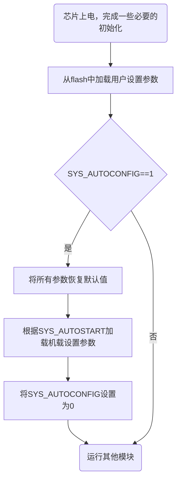

# 机架设置

机架（airframe）是用于管理不同飞机（SYS_AUTOSTART）的param和mixer等，当前切换机架之后，会将所有参数重置为机架设置的值，这样确保飞控系统能够同时兼容和支持多款无人机。

## 机架工作原理
>
> SYS_AUTOSTART：机架编号，一个飞控里里面包含了多架飞机配置，修改机架会将SYS_AUTOCONFIG设置为1，下次重启会自动重置机架参数。

> SYS_AUTOCONFIG：是否重置机架参数，如果==1则将参数值重置为机架设定值，随后将SYS_AUTOCONFIG置零，避免下次启动再次重置机架参数。



## 添加新的机架

在airframe文件中增加一个新的`xxx_yyy.cpp`文件，其中：

- xxx：是机架编号，比如`1102`
- yyy：是机架名称，比如`sih_standard_vtol`

`1102_sih_standard_vtol`主要是定义`_param`和`_mixer`两个结构体数组。

### 定义机架参数

### 定义机架混控

#### 多旋翼混控

#### 固定翼混控

#### NULL混控

### 导出机架设置

在文件的结尾，通过以下宏导出机架设置：
`AIRFRAME_DEFINE_ALL`宏有4个参数，第1个是机架名称，第2个是机架编号，第3个是参数定义，第4个是混控定义：

```c
AIRFRAME_DEFINE_ALL(sih_standard_vtol, 1102, _param, _mixer);

```

### 完整机架例子

下面是`1102_sih_standard_vtol`机架的完整配置文件。

```c++
#include "airframe.h"

static param_config_t _param[] = {
    // vtol_default_param

    // set SYS_HITL to 2 to start the SIH and avoid sensors startup
    PARAM_CONFIG_INT32(SYS_HITL, 2),
    PARAM_CONFIG_INT32(SYS_MC_EST_GROUP, 4),
    PARAM_CONFIG_INT32(MAV_TYPE, 20),        // commander need
    PARAM_CONFIG_INT32(SYS_VEHICLE_TYPE, 2), // run as standard vtol
    PARAM_CONFIG_INT32(SIH_VEHICLE_TYPE, 2), // sih as standard vtol

    // qemu仿真时网络选择了user模式，故这里IP配置为网关IP即可
    PARAM_CONFIG_INT32(MAV_0_CONFIG, 10),
    PARAM_CONFIG_INT32(MAV_0_RMT_IP, 10 << 24 | 0 << 16 | 2 << 8 | 2),
    PARAM_CONFIG_INT32(MAV_0_RMT_PORT, 14550),
    PARAM_CONFIG_INT32(MAV_1_CONFIG, 0),
    PARAM_CONFIG_INT32(MAV_2_CONFIG, 0),

    // disable some checks to allow to fly:
    // - with usb
    PARAM_CONFIG_INT32(CBRK_USB_CHK, 197848),
    // - without real battery
    PARAM_CONFIG_INT32(CBRK_SUPPLY_CHK, 894281),
    // - without safety switch
    PARAM_CONFIG_INT32(COM_PREARM_MODE, 0),
    PARAM_CONFIG_INT32(CBRK_IO_SAFETY, 22027),
    PARAM_CONFIG_INT32(BAT_N_CELLS, 3),

    PARAM_CONFIG_FLOAT(SIH_T_MAX, 6.0),
    PARAM_CONFIG_FLOAT(SIH_MASS, 1.0),
    PARAM_CONFIG_FLOAT(SIH_IXX, 0.0292),
    PARAM_CONFIG_FLOAT(SIH_IYY, 0.0394),
    PARAM_CONFIG_FLOAT(SIH_IZZ, 0.0477),
    PARAM_CONFIG_FLOAT(SIH_IXZ, 0.00046),
    PARAM_CONFIG_FLOAT(SIH_KDV, 0.2),

    // 模拟器通道不需要反向
    PARAM_CONFIG_INT32(PWM_AUX_REV1, 0),
    PARAM_CONFIG_INT32(PWM_AUX_REV2, 0),
    PARAM_CONFIG_INT32(PWM_AUX_REV3, 0),
    PARAM_CONFIG_INT32(PWM_AUX_REV4, 0),

    // 美国手
    PARAM_CONFIG_INT32(RC_MAP_ROLL, 1),
    PARAM_CONFIG_INT32(RC_MAP_PITCH, 2),
    PARAM_CONFIG_INT32(RC_MAP_YAW, 3),
    PARAM_CONFIG_INT32(RC_MAP_THROTTLE, 4),
};

static mixer_config_t _mixer[] = {
    MIXER_DEFINE_MC(
        // rotor_count
        MIXER_MC_COUNT(4),
        // roll, pitch, yaw, throttle
        // @output MAIN1 left forward motor
        MIXER_MC_SCALE(-0.707107f, 0.707107f, 1.000000f, 1.000000f), // 右前，逆时针
        // @output MAIN2
        MIXER_MC_SCALE(0.707107f, -0.707107f, 1.000000f, 1.000000f),   // 左后，逆时针
        MIXER_MC_SCALE(0.707107f, 0.707107f, -1.000000f, 1.000000f),   // 左前，顺时针
        MIXER_MC_SCALE(-0.707107f, -0.707107f, -1.000000f, 1.000000f), // 右后，顺时针
        ),

    // 前拉
    MIXER_DEFINE_SIMPLE(
        MIXER_SIMPLE_COUNT(1),                       // control_count
        MIXER_SIMPLE_SCALE(1.0, 1.0, 0, -1, 1),      // output_scale = k-, k+, offset, min, max
        MIXER_SIMPLE_CONTROL(1, 3, 0, 2, -1, -1, 1), // control_scale = group, index, k-, k+, offset, min, max
        ),

    //  三个zero通道
    MIXER_DEFINE_NULL(),
    MIXER_DEFINE_NULL(),
    MIXER_DEFINE_NULL(),

    // 左副翼
    MIXER_DEFINE_SIMPLE(
        MIXER_SIMPLE_COUNT(1),                              // control_count
        MIXER_SIMPLE_SCALE(1.0, 1.0, 0, -1, 1),             // output_scale = k-, k+, offset, min, max
        MIXER_SIMPLE_CONTROL(1, 0, -0.75, -0.75, 0, -1, 1), // control_scale = group, index, k-, k+, offset, min, max
        ),

    // 右副翼
    MIXER_DEFINE_SIMPLE(
        MIXER_SIMPLE_COUNT(1),                            // control_count
        MIXER_SIMPLE_SCALE(1.0, 1.0, 0, -1, 1),           // output_scale = k-, k+, offset, min, max
        MIXER_SIMPLE_CONTROL(1, 0, 0.75, 0.75, 0, -1, 1), // control_scale = group, index, k-, k+, offset, min, max
        ),

    // 左升降舵
    MIXER_DEFINE_SIMPLE(
        MIXER_SIMPLE_COUNT(1),                          // control_count
        MIXER_SIMPLE_SCALE(1.0, 1.0, 0, -1, 1),         // output_scale = k-, k+, offset, min, max
        MIXER_SIMPLE_CONTROL(1, 1, 1.0, 1.0, 0, -1, 1), // control_scale = group, index, k-, k+, offset, min, max
        ),

    // 右升降舵
    MIXER_DEFINE_SIMPLE(
        MIXER_SIMPLE_COUNT(1),                          // control_count
        MIXER_SIMPLE_SCALE(1.0, 1.0, 0, -1, 1),         // output_scale = k-, k+, offset, min, max
        MIXER_SIMPLE_CONTROL(1, 1, 1.0, 1.0, 0, -1, 1), // control_scale = group, index, k-, k+, offset, min, max
        ),

    // 方向舵
    MIXER_DEFINE_SIMPLE(
        MIXER_SIMPLE_COUNT(1),                          // control_count
        MIXER_SIMPLE_SCALE(1.0, 1.0, 0, -1, 1),         // output_scale = k-, k+, offset, min, max
        MIXER_SIMPLE_CONTROL(1, 2, 1.0, 1.0, 0, -1, 1), // control_scale = group, index, k-, k+, offset, min, max
        ),

};

AIRFRAME_DEFINE_ALL(sih_standard_vtol, 1102, _param, _mixer);
```### 定义机架参数

### 定义机架混控

#### 多旋翼混控

#### 固定翼混控

#### NULL混控

### 导出机架设置

在文件的结尾，通过以下宏导出机架设置：
`AIRFRAME_DEFINE_ALL`宏有4个参数，第1个是机架名称，第2个是机架编号，第3个是参数定义，第4个是混控定义：

```c
AIRFRAME_DEFINE_ALL(sih_standard_vtol, 1102, _param, _mixer);

```

### 完整机架例子

下面是`1102_sih_standard_vtol`机架的完整配置文件。

```c++
#include "airframe.h"

static param_config_t _param[] = {
    // vtol_default_param

    // set SYS_HITL to 2 to start the SIH and avoid sensors startup
    PARAM_CONFIG_INT32(SYS_HITL, 2),
    PARAM_CONFIG_INT32(SYS_MC_EST_GROUP, 4),
    PARAM_CONFIG_INT32(MAV_TYPE, 20),        // commander need
    PARAM_CONFIG_INT32(SYS_VEHICLE_TYPE, 2), // run as standard vtol
    PARAM_CONFIG_INT32(SIH_VEHICLE_TYPE, 2), // sih as standard vtol

    // qemu仿真时网络选择了user模式，故这里IP配置为网关IP即可
    PARAM_CONFIG_INT32(MAV_0_CONFIG, 10),
    PARAM_CONFIG_INT32(MAV_0_RMT_IP, 10 << 24 | 0 << 16 | 2 << 8 | 2),
    PARAM_CONFIG_INT32(MAV_0_RMT_PORT, 14550),
    PARAM_CONFIG_INT32(MAV_1_CONFIG, 0),
    PARAM_CONFIG_INT32(MAV_2_CONFIG, 0),

    // disable some checks to allow to fly:
    // - with usb
    PARAM_CONFIG_INT32(CBRK_USB_CHK, 197848),
    // - without real battery
    PARAM_CONFIG_INT32(CBRK_SUPPLY_CHK, 894281),
    // - without safety switch
    PARAM_CONFIG_INT32(COM_PREARM_MODE, 0),
    PARAM_CONFIG_INT32(CBRK_IO_SAFETY, 22027),
    PARAM_CONFIG_INT32(BAT_N_CELLS, 3),

    PARAM_CONFIG_FLOAT(SIH_T_MAX, 6.0),
    PARAM_CONFIG_FLOAT(SIH_MASS, 1.0),
    PARAM_CONFIG_FLOAT(SIH_IXX, 0.0292),
    PARAM_CONFIG_FLOAT(SIH_IYY, 0.0394),
    PARAM_CONFIG_FLOAT(SIH_IZZ, 0.0477),
    PARAM_CONFIG_FLOAT(SIH_IXZ, 0.00046),
    PARAM_CONFIG_FLOAT(SIH_KDV, 0.2),

    // 模拟器通道不需要反向
    PARAM_CONFIG_INT32(PWM_AUX_REV1, 0),
    PARAM_CONFIG_INT32(PWM_AUX_REV2, 0),
    PARAM_CONFIG_INT32(PWM_AUX_REV3, 0),
    PARAM_CONFIG_INT32(PWM_AUX_REV4, 0),

    // 美国手
    PARAM_CONFIG_INT32(RC_MAP_ROLL, 1),
    PARAM_CONFIG_INT32(RC_MAP_PITCH, 2),
    PARAM_CONFIG_INT32(RC_MAP_YAW, 3),
    PARAM_CONFIG_INT32(RC_MAP_THROTTLE, 4),
};

static mixer_config_t _mixer[] = {
    MIXER_DEFINE_MC(
        // rotor_count
        MIXER_MC_COUNT(4),
        // roll, pitch, yaw, throttle
        // @output MAIN1 left forward motor
        MIXER_MC_SCALE(-0.707107f, 0.707107f, 1.000000f, 1.000000f), // 右前，逆时针
        // @output MAIN2
        MIXER_MC_SCALE(0.707107f, -0.707107f, 1.000000f, 1.000000f),   // 左后，逆时针
        MIXER_MC_SCALE(0.707107f, 0.707107f, -1.000000f, 1.000000f),   // 左前，顺时针
        MIXER_MC_SCALE(-0.707107f, -0.707107f, -1.000000f, 1.000000f), // 右后，顺时针
        ),

    // 前拉
    MIXER_DEFINE_SIMPLE(
        MIXER_SIMPLE_COUNT(1),                       // control_count
        MIXER_SIMPLE_SCALE(1.0, 1.0, 0, -1, 1),      // output_scale = k-, k+, offset, min, max
        MIXER_SIMPLE_CONTROL(1, 3, 0, 2, -1, -1, 1), // control_scale = group, index, k-, k+, offset, min, max
        ),

    //  三个zero通道
    MIXER_DEFINE_NULL(),
    MIXER_DEFINE_NULL(),
    MIXER_DEFINE_NULL(),

    // 左副翼
    MIXER_DEFINE_SIMPLE(
        MIXER_SIMPLE_COUNT(1),                              // control_count
        MIXER_SIMPLE_SCALE(1.0, 1.0, 0, -1, 1),             // output_scale = k-, k+, offset, min, max
        MIXER_SIMPLE_CONTROL(1, 0, -0.75, -0.75, 0, -1, 1), // control_scale = group, index, k-, k+, offset, min, max
        ),

    // 右副翼
    MIXER_DEFINE_SIMPLE(
        MIXER_SIMPLE_COUNT(1),                            // control_count
        MIXER_SIMPLE_SCALE(1.0, 1.0, 0, -1, 1),           // output_scale = k-, k+, offset, min, max
        MIXER_SIMPLE_CONTROL(1, 0, 0.75, 0.75, 0, -1, 1), // control_scale = group, index, k-, k+, offset, min, max
        ),

    // 左升降舵
    MIXER_DEFINE_SIMPLE(
        MIXER_SIMPLE_COUNT(1),                          // control_count
        MIXER_SIMPLE_SCALE(1.0, 1.0, 0, -1, 1),         // output_scale = k-, k+, offset, min, max
        MIXER_SIMPLE_CONTROL(1, 1, 1.0, 1.0, 0, -1, 1), // control_scale = group, index, k-, k+, offset, min, max
        ),

    // 右升降舵
    MIXER_DEFINE_SIMPLE(
        MIXER_SIMPLE_COUNT(1),                          // control_count
        MIXER_SIMPLE_SCALE(1.0, 1.0, 0, -1, 1),         // output_scale = k-, k+, offset, min, max
        MIXER_SIMPLE_CONTROL(1, 1, 1.0, 1.0, 0, -1, 1), // control_scale = group, index, k-, k+, offset, min, max
        ),

    // 方向舵
    MIXER_DEFINE_SIMPLE(
        MIXER_SIMPLE_COUNT(1),                          // control_count
        MIXER_SIMPLE_SCALE(1.0, 1.0, 0, -1, 1),         // output_scale = k-, k+, offset, min, max
        MIXER_SIMPLE_CONTROL(1, 2, 1.0, 1.0, 0, -1, 1), // control_scale = group, index, k-, k+, offset, min, max
        ),

};

AIRFRAME_DEFINE_ALL(sih_standard_vtol, 1102, _param, _mixer);
```

## 机架编号分配

- [0-999] Reserved (historical)

### 仿真机

- [1000, 1999] Simulation setups，用于仿真的机架

### 固定翼

- [2000, 2999] Standard planes，标准固定翼无人机
- [3000, 3999] Flying wing，飞翼布局无人机

### 多旋翼

- [4000, 4999] Quadrotor x，四旋翼（x）
- [5000, 5999] Quadrotor +，四旋翼（+）
- [6000, 6999] Hexarotor x，六旋翼（x）
- [7000, 7999] Hexarotor +"，六旋翼（+）
- [8000, 8999] Octorotor +"，八旋翼（x）
- [9000, 9999] Octorotor +"，八旋翼（+）
- [10000, 10999] Quadrotor Wide arm / H frame
- [11000, 11999] Hexa Cox，共轴六旋翼
- [12000, 12999] Octo Cox，共轴八旋翼

### 复合翼

- [13000, 13999] VTOL，垂起无人机
- [14000, 14999] Tri Y，三角翼（Y）
- [17000, 17999] Autogyro，直升机

### 热气球

- [18000, 18999] High-altitude balloons，热气球

### 自定义

- [22000, 22999] Reserve for custom models，自定义无人机

### 无人船

- [60000, 61000] (Unmanned) Underwater Robots，水下机器人

## 控制输出分组

### Control Group #0 (Flight Control)

0: roll (-1..1)
1: pitch (-1..1)
2: yaw (-1..1)
3: throttle (0..1 normal range, -1..1 for variable pitch / thrust reversers)
4: flaps (-1..1)
5: spoilers (-1..1)
6: airbrakes (-1..1)
7: landing gear (-1..1)

### Control Group #1(Flight Control VTOL / Alternate)

0: roll ALT (-1..1)
1: pitch ALT (-1..1)
2: yaw ALT (-1..1)
3: throttle ALT (0..1 normal range, -1..1 for variable pitch / thrust reversers)
4: reserved / aux0
5: reserved / aux1
6: reserved / aux2
7: reserved / aux3

### Control Group #2(Gimbal)

0: gimbal roll
1: gimbal pitch
2: gimbal yaw
3: gimbal shutter
4: camera zoom
5: reserved
6: reserved
7: reserved (parachute, -1..1)

### Control Group #3(Manual Passthrough)

0: RC roll
1: RC pitch
2: RC yaw
3: RC throttle
4: RC mode switch (Passthrough of RC channel mapped by RC_MAP_FLAPS)
5: RC aux1 (Passthrough of RC channel mapped by RC_MAP_AUX1)
6: RC aux2 (Passthrough of RC channel mapped by RC_MAP_AUX2)
7: RC aux3 (Passthrough of RC channel mapped by RC_MAP_AUX3)

### Control Group #4 (Flight Control MC VIRTUAL)

0: roll ALT (-1..1)
1: pitch ALT (-1..1)
2: yaw ALT (-1..1)
3: throttle ALT (0..1 normal range, -1..1 for variable pitch / thrust reversers)
4: reserved / aux0
5: reserved / aux1
6: reserved / aux2
7: reserved / aux3

### Control Group #5(Flight Control FW VIRTUAL)

0: roll ALT (-1..1)
1: pitch ALT (-1..1)
2: yaw ALT (-1..1)
3: throttle ALT (0..1 normal range, -1..1 for variable pitch / thrust reversers)
4: reserved / aux0
5: reserved / aux1
6: reserved / aux2
7: reserved / aux3

### Control Group #6 (First Payload)

0: function 0
1: function 1
2: function 2
3: function 3
4: function 4
5: function 5
6: function 6
7: function 7
