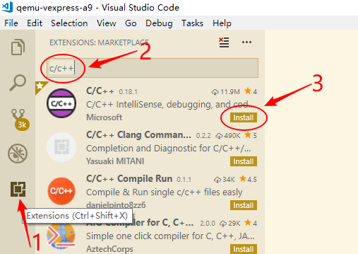

# 断点单步调试

NextPilot支持 Keil MDK5 和 VS Code 两种集成开发环境，两者都是先通过scons工具生成相应的 MDK5 工程和 VS Code 配置，然后再使用 IDE 进行编译、调试、烧录等。

> 注意：飞行仿真sitl/qemu只支持VS Code+Gcc，**不支持 MDK5**；普通STM32程序支持 Vscode 和 MDK5，但是推荐 MDK5。

Vscode一款很好的编辑器，拥有极强的扩展性，因此推荐使用VScode进行代码编辑，至于编译和调试可以根据个人喜好。

## Keil MDK5

### 安装MDK5工具

> 注意：MDK 建议使用 **V5.38** 及以上版本，编译器采用 **ARMCLANG v6.19**，开启支持 C++14。

请访问[Keil MDK更新页面](https://www.keil.com/update/rvmdk.asp)，选择需要的版本。


跳转到对应版本页面之后，需要填写很多信息，尤其是`LIC or PSN`，因此不适合绝大部分个人开发者。其实 MDK 都是使用 **有规律的下载链接**，相信聪明的你一定能够找其中的规律哦，通过该方法可以下载任意历史版本。

|版本|下载链接|
|---|---|
|MDK525.EXE|<https://armkeil.blob.core.windows.net/eval/MDK525.EXE>|
|MDK527.EXE|<https://armkeil.blob.core.windows.net/eval/MDK527.EXE>|
|MDK529.EXE|<https://armkeil.blob.core.windows.net/eval/MDK529.EXE>|
|MDK536.EXE|<https://armkeil.blob.core.windows.net/eval/MDK536.EXE>|
|MDK538a.EXE|<https://armkeil.blob.core.windows.net/eval/MDK538a.EXE>|
|MDK540.EXE|<https://armkeil.blob.core.windows.net/eval/MDK540.EXE>|

除了安装keil工具，芯片的pack包也是必不可少的，请到<https://www.keil.arm.com/devices>找到自己的芯片，并下载相应的pack。下面列出了STM32F1/F4/F7/H7当前最新版本的pack下载连接：

- <https://www.keil.com/pack/Keil.STM32F1xx_DFP.2.4.1.pack>
- <https://www.keil.com/pack/Keil.STM32F4xx_DFP.2.17.1.pack>
- <https://www.keil.com/pack/Keil.STM32F7xx_DFP.2.16.0.pack>
- <https://www.keil.com/pack/Keil.STM32H7xx_DFP.3.1.1.pack>

### 生成MDK5工程

通过 scons 工具直接生成 MDK5 工程，然后用 MDK5 进行开发。

```shell
# 切换target目录
cd nextpilot-flight-control/bsps/fcs-v1

# 生成mdk5工程
scons --target=mdk5
```

### 调试MDK5工程

用 MDK5 打开 `nextpilot-flight-control/bsps/fcs-v1/project.uvprojx`，接下来就可以愉快的使用 MDK5 进行项目的调试了。

## VS Code

VS Code（全称 [Visual Studio Code](https://azure.microsoft.com/zh-cn/products/visual-studio-code/)）是一个轻量且强大的代码编辑器，支持 Windows，OS X 和 Linux。内置 JavaScript、TypeScript 和 Node.js 支持，而且拥有丰富的插件生态系统，可通过安装插件来支持 C++、C#、Python、PHP 等其他语言。

### 安装和配置

下载[Visual Stuio Code](https://azure.microsoft.com/zh-cn/products/visual-studio-code/)，一路默认安装即可。然后使用vscode打开`nextpilot-flight-control.code-workspace`，如果是第一次打开会提醒您安装`推荐扩展`，一定要点`确定`哈，会自动安装以下扩展：

|插件|用途|
| :--- | :--- |
|ms-ceintl.vscode-language-pack-zh-hans| 中文（简体）语言包为 VS Code 提供本地化界面。 |
| ms-vscode.cpptools                     |C/ C++扩展为 VS Code 添加了对C/C++的语言支持，包括编辑（智能感知）和调试功能。|
|ms-vscode.cpptools-extension-pack|扩展包包含了一组在 VS Code 中用于c++开发的流行扩展: C/C++, C/C++ Thems, CMake, CMake Tools|
|ms-vscode.cpptools-themes|一个 VS Code 的扩展，它提供了额外的主题选项，特别是为 C++ 开发环境定制的颜色主题。这些主题可以帮助改善代码的可读性和编辑器的视觉体验，特别是在处理 C++ 代码时。通过使用这些主题，开发者可以根据个人喜好或视觉需求来定制他们的开发环境。|
| ms-python.python | 一个 VS Code 的扩展插件，主要用于提供 Python 开发的增强支持。这个插件包括了许多功能，比如代码自动完成、智能提示、代码调试、测试、代码格式化等。它是 Python 开发者在使用 VS Code 时的重要工具，可以极大地提高开发效率和代码质量。 |
| ms-python.debugpy | 一个 Python 调试库，用于在 VS Code 中提供调试支持。它允许开发者在 VS Code 中设置断点、单步执行代码、查看变量值、评估表达式等，从而帮助开发者调试 Python 程序。这个库是 Microsoft 官方提供的，是 VS Code Python 插件的一部分。 |
| ms-python.black-formatter | 一个用于格式化 Python 代码的工具，它根据 PEP 8 风格指南自动格式化代码。这样可以确保 Python 代码遵循一致的格式标准，有助于提高代码的可读性和可维护性。 |
| ms-vscode.vscode-embedded-tools | 一个 VS Code 的扩展，它用于支持嵌入式开发。这个扩展提供了一系列工具和功能，帮助开发者在 VS Code 环境中更有效地开发、调试和测试嵌入式系统。这可能包括对特定硬件的支持、调试器接口、以及与嵌入式设备通信的功能等。 |
| marus25.cortex-debug | 一个用于 VS Code 的插件，主要用于调试 ARM Cortex-M 微控制器。它提供了对硬件断点、寄存器查看、内存查看、堆栈跟踪等功能的支持，使得开发者可以更方便地进行嵌入式开发的调试工作。这个插件利用了 GDB（GNU Debugger）来进行调试，并且可以与多种调试器硬件（如 J-Link、ST-Link 等）配合使用。 |
| rt-thread.rt-thread-studio | 一个集成开发环境（IDE），专为 RT-Thread 实时操作系统（RTOS）设计。它提供了一个全面的开发环境，支持 RT-Thread 的配置、编程、调试和项目管理。RT-Thread Studio 旨在简化开发 RT-Thread 应用程序的过程，提供图形化配置工具、代码编辑器、编译器以及调试功能。这使得开发者能够更高效地开发面向嵌入式系统的应用程序。 |
| nordic-semiconductor.nrf-kconfig | 用于 Nordic Semiconductor 的 nRF 系列产品的配置系统。它基于 Kconfig 语言，这是一种用于配置内核选项的语言，最初是为 Linux 内核开发的。在 Nordic 的 nRF SDK 中，这个工具使得开发者可以通过图形界面或命令行界面来选择和配置不同的硬件和软件功能，以适应特定的应用需求。这包括设置如蓝牙功能、电源管理、GPIO 配置等。通过这种方式，开发者可以轻松地定制他们的固件，以最大化硬件的性能和功能。 |
| DavidAnson.vscode-markdownlint | 一个 VS Code 的扩展插件，用于检查 Markdown 文件中的语法和样式问题。它帮助开发者遵守一定的 Markdown 编写规范，提高文档的可读性和一致性。这个插件可以自动检测常见的格式错误和不规范的写法，比如标题层级不正确、列表格式错误、代码块未指定语言等，并提供修正建议。 |
| samuelcolvin.jinjahtml | 一个用于 VS Code 的插件，它提供了对 Jinja 模板语言的语法高亮和代码片段支持。Jinja 是一个流行的模板引擎，通常用于 Python Web 开发，特别是与 Flask 和 Django 框架结合使用。这个插件可以帮助开发者更容易地编写和理解 Jinja 模板文件 |
| tamasfe.even-better-toml | 一个 Python 库，用于解析和生成 TOML（Tom's Obvious, Minimal Language）格式的数据。TOML 是一种用于配置文件的数据序列化格式，类似于 JSON 或 YAML，但更易于阅读和编辑。这个库提供了比标准 TOML 库更多的功能和更好的性能，使得处理 TOML 数据更加高效和方便。 |
| redhat.vscode-yaml | 一个 VS Code 的扩展插件，主要用于提供 YAML 文件的语法高亮、自动完成、格式化以及验证功能。它可以帮助开发者更有效地编写和管理 YAML 配置文件，特别是在处理复杂的结构时，能够确保文件的正确性和一致性。此外，该插件还支持YAML Schema，可以根据用户定义的 Schema 自动验证 YAML 文件，并提供错误提示和自动补全功能。 |

当然您也可以手动安装相应的扩展，比如：



安装好后确认插件为以下状态，如果不是则点击重新加载：


### 编译和调试

#### 打开工作区

双击根目录下的`nextpilot-flight-control.code-workspace`即可打开VSCode工作区。如下图所示：


#### 选择工程

在打开工作区后，点击左侧 RT-Thread Studio插件，选择一个bsp工程，比如`qemu-vexpress-a9`，如下图所示：


将鼠标放置到 qemu 工程，会自动弹出开发工具栏图标，包括了编译、烧写、调试、擦除，在使用这些功能之前，需要配置下`.vscode/setting.json`和`.vscode/launch.json`文件，不过 nextpilot 已经为您做好了这一切，您只要在`qemu-vexpress-a9`目录下运行`scons`会自动帮您生成所需的配置文件。

#### 编译工程

配置完成后，点击编译按钮，即可进行工程编译。


选择fcs bsp或点击编译后，vscode的TERMINAL终端会自动启动env环境然后切换至fcs所在目录。


#### 烧写程序

完成编译后，点击烧写按钮，即可进行固件烧写。


烧写打印结果如下图所示：


#### 单步调试

按调试按钮，或者按F5，可以进行调试。


> 注意：只有BUILD选项为'debug'时才能够进行调试。

进入调试后的效果如下图所示：


