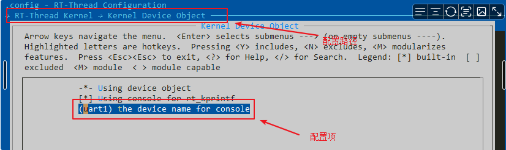
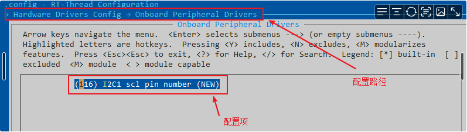
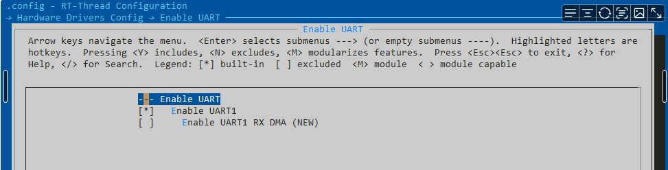
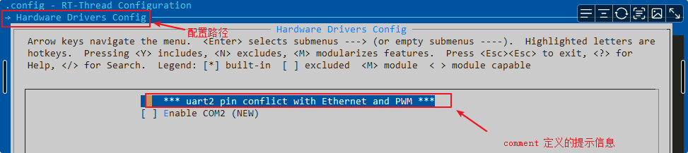

# Kconfig

## Kconfig在RT-Thread中的工作机制

C语言项目的裁剪配置本质上通过条件编译和宏的展开来实现的，RT-Thread借助Kconfig这套机制更方便的实现了这一功能。当前以Windows下Env工具中的使用为例，简述Kconfig在RT-Thread的工作机制。

Kconfig机制包括了Kconfig文件和配置UI界面（如menuconfig，pyconfig等）。Kconfig机制有如下特点：

- Kconfig文件中的配置项会映射至rtconfig.h中
- Kconfig文件可以随源码分散至各级子目录，便于灵活修改。

```Ini
# .config片段
CONFIG_RT_USING_TIMER_SOFT=y
CONFIG_RT_TIMER_THREAD_PRIO=4
CONFIG_RT_TIMER_THREAD_STACK_SIZE=512
CONFIG_RT_DEBUG=y

```

```C
// 相对应的rtconfig.h片段
#define RT_USING_TIMER_SOFT
#define RT_TIMER_THREAD_PRIO 4
#define RT_TIMER_THREAD_STACK_SIZE 512
#define RT_DEBUG
```


Kconfig文件在源码中呈现树形结构，需要**在工程的根目录下存在一份顶层Kconfig文件**，顶层Kconfig文件在文件中通过source语句显示地调用各子目录下的Kconfig文件。Env在根目录下执行menuconfig命令后会递归解析各级Kconfig文件，然后提供如下配置界面，完成相应的配置后并保存，根目录下会存在一份.config文件保存当前选择的配置项，并将.config文件转为RT-Thread的系统配置文件rtconfig.h。


## Kconfig语法及示例

Kconfig源于[Linux内核的配置构建系统](https://www.kernel.org/doc/html/latest/kbuild/kconfig-language.html#)，当前只介绍RT-Thread中的常用语法。

### 注释

Kconfig 采用 `#` 作为注释标记符，例如：

```C
# This is a comment
```

### config语句

config 定义了一组新的配置选项

以下为 RT-Thread 系统中 config 语句的示例

```C
config BSP_USING_GPIO
    bool "Enable GPIO"
    select RT_USING_PIN
    default y
    help
    config gpio
```

以上代码对应的配置界面如下所示


对应的帮助信息界面如下所示


语句分析：

- config 表示一个配置选项的开始，紧跟着的 BSP_USING_GPIO 是配置选项的名称，config 下面几行定义了该配置选项的属性。属性可以是该配置选项的
  - 类型
  - 输入提示
  - 依赖关系
  - 默认值
  - 帮助信息
- bool 表示配置选项的类型，每个 config 菜单项都要有类型定义，变量有5种类型
  - bool 布尔类型
  - tristate 三态类型
  - string 字符串
  - hex 十六进制
  - int 整型
- select 是反向依赖关系的意思，即当前配置选项被选中，则 RT_USING_PIN 就会被选中。
- default 表示配置选项的默认值，bool 类型的默认值可以是 y/n。
- help 帮助信息。

通过 env 选中以上配置界面的选项后，最终可在 rtconfig.h 文件中生成如下两个宏

```C
#define RT_USING_PIN
#define BSP_USING_GPIO
```

### 变量类型

#### bool类型

布尔类型变量的取值范围是 y/n ，其使用示例如下

```C
config BSP_USING_WDT
    bool "Enable Watchdog Timer"
    select RT_USING_WDT
    default n
```

上述语句对应的配置界面如下所示


以上配置项在 rtconfig.h 文件中生成的宏如下所示

```C
#define BSP_USING_WDT
#define RT_USING_WDT
```

#### string类型

字符串变量的默认值是一个字符串，其使用示例如下

```C
config RT_CONSOLE_DEVICE_NAME
    string "the device name for console"
    default "uart1"
```

上述语句对应的配置界面如下所示



以上配置项在 rtconfig.h 文件中生成的宏如下所示

```C
#define RT_CONSOLE_DEVICE_NAME "uart1"
```

#### int类型

整型变量的取值范围是一个整型的数，其使用示例如下

```C
config BSP_I2C1_SCL_PIN
    int "I2C1 scl pin number"
    range 1 176
    default 116
```

上述语句对应的配置界面如下所示



以上配置项在 rtconfig.h 文件中生成的宏如下所示

```C
#define BSP_I2C1_SCL_PIN 116
```

#### hex类型

十六进制类型变量的取值范围是一个十六进制的数，其使用方法和整型变量用法一致，整型变量生成的是十进制的数，而十六进制生成的是十六进制的数。

#### tristate类型

三态类型变量的取值范围是 y、n 和 m。tristate 代表在内核中有三种状态，一种是不选中，一种是选中直接编译进内核，还有一种是 m 手动添加驱动，而布尔类型变量只有两种状态，即选中和不选中。其使用方法和布尔类型变量类似。

### menu/endmenu语句

menu 语句用于生成菜单。

以下为 RT-Thread 系统中 menu/endmenu 语句的示例

```C
menu "Hardware Drivers Config"
    config BSP_USING_COM2
        bool "Enable COM2 (uart2 pin conflict with Ethernet and PWM)"
        select BSP_USING_UART
        select BSP_USING_UART2
        default n
    config BSP_USING_COM3
        bool "Enable COM3 (uart3 pin conflict with Ethernet)"
        select BSP_USING_UART3
        default n
endmenu
```

menu 之后的字符串是菜单名。menu 和 endmenu 间有很多 config 语句，以上代码对应的配置界面如下所示


其中 Hardware Drivers Config 就是菜单名，然后进入这个菜单有 Enable COM2、Enable COM3 等选项，如下图所示


通过 env 选中以上配置界面的所有选项后，最终可在 rtconfig.h 文件中生成如下五个宏

```C
#define BSP_USING_UART
#define BSP_USING_UART2
#define BSP_USING_UART3
#define BSP_USING_COM2
#define BSP_USING_COM3
```

### if/endif语句

if/endif 语句是一个条件判断，定义了一个 if 结构，示例代码如下

```C
menu "Hardware Drivers Config"
    menuconfig BSP_USING_CAN
        bool "Enable CAN"
        default n
        select RT_USING_CAN
        if BSP_USING_CAN
            config BSP_USING_CAN1
                bool "Enable CAN1"
                default n
        endif
endmenu
```

当没有选中 "Enable CAN" 选项时，下面通过 if 判断的 Enable CAN1 选项并不会显示出来，如下图所示


当上一级菜单选中 "Enable CAN" 时


### menuconfig语句

menuconfig 语句表示带菜单的配置项

以下为 RT-Thread 系统 menuconfig 语句的示例

```C
menu "Hardware Drivers Config"
    menuconfig BSP_USING_UART
        bool "Enable UART"
        default y
        select RT_USING_SERIAL
        if BSP_USING_UART
            config BSP_USING_UART1
                bool "Enable UART1"
                default y

            config BSP_UART1_RX_USING_DMA
                bool "Enable UART1 RX DMA"
                depends on BSP_USING_UART1 && RT_SERIAL_USING_DMA
                default n
        endif
endmenu
```

当没有打开串口 DMA 配置时，以上代码对应的界面为


当打开串口 DMA 配置时，以上代码对应的界面为



语句分析：

- menuconfig 这个语句和 config 语句很相似，但它在 config 的基础上要求所有的子选项作为独立的行显示。
- depends on 表示依赖某个配置选项，`depends on BSP_USING_UART1 && RT_SERIAL_USING_DMA` 表示只有当 BSP_USING_UART1 和 RT_SERIAL_USING_DMA 配置选项同时被选中时，当前配置选项的提示信息才会出现，才能设置当前配置选项

通过 env 选中以上配置界面的所有选项后，最终可在 rtconfig.h 文件中生成如下五个宏

```C
#define RT_USING_SERIAL
#define BSP_USING_UART
#define BSP_USING_UART1
#define RT_SERIAL_USING_DMA
#define BSP_UART1_RX_USING_DMA
```

### choice/endchoice语句

choice 语句将多个类似的配置选项组合在一起，供用户选择一组配置项

RT-Thread Kconfig 文件中 choice 代码示例如下

```C
menu "Hardware Drivers Config"
    menuconfig BSP_USING_ONCHIP_RTC
        bool "Enable RTC"
        select RT_USING_RTC
        select RT_USING_LIBC
        default n
        if BSP_USING_ONCHIP_RTC
            choice
                prompt "Select clock source"
                default BSP_RTC_USING_LSE

                config BSP_RTC_USING_LSE
                    bool "RTC USING LSE"

                config BSP_RTC_USING_LSI
                    bool "RTC USING LSI"
            endchoice
        endif
endmenu
```

以上代码对应的配置界面为


语句解析：

- choice/endchoice 给出选择项，中间可以定义多个配置项供选择，但是在配置界面只能选择一个配置项；
- prompt 给出提示信息，光标选中后回车进入就可以看到多个 config 条目定义的配置选项，所以下面的两个例子是等价的：

```C
bool "Networking support"
 
bool
prompt "Networking support"
```

### comment语句

comment 语句出现在界面的第一行，用于定义一些提示信息。

comment 代码示例如下

```C
menu "Hardware Drivers Config"
    comment "uart2 pin conflict with Ethernet and PWM"
    config BSP_USING_COM2
        bool "Enable COM2"
        select BSP_USING_UART
        select BSP_USING_UART2
        default n
endmenu
```

以上代码对应的配置界面为



### source语句

source 语句用于读取另一个文件中的 Kconfig 文件，如：

```C
source "../libraries/HAL_Drivers/Kconfig"

```

上述语句用于读取当前 Kconfig 文件所在路径的上一级文件夹 libraries/HAL_Drivers 下的 Kconfig 文件。

## FAQ

### 如何在menuconfig隐藏一些config

Kconfig中有个特殊的用法，在制作大型软件包的时候会遇到，就是有一些宏定义是不愿意让客户在 menuconfig 中进行修改的，但是又是相关开源软件包中必须要包含的，而且数目也比较众多的，对 Kconfig 一些选项有一些依赖的，也就是不希望该配置选项出现在 menuconfig 中。

下面以 Kconfig 举例说明：

```C
config BSP_USING_GPIO
    bool "Enable GPIO"
    default y
```

将上述语句中的 `bool` 后面的注释去掉。

```C
config BSP_USING_GPIO
    bool
    default y
```

这个时候在 menuconfig 中就不会出现该宏定义，但是宏定义还是会有

### depends on和select语句的区别

例如，如下配置

```C
config BSP_USING_UART3
    bool "UART3 config"
    depends on BSP_USING_UART
    select RT_USING_SERIAL
    default n
```

这个其中的含义是：BSP_USING_UART3 是否需要呈现给客户配置和选中，依赖于 BSP_USING_UART 这个配置是否打开。 一旦 BSP_USING_UART3 选中了，RT_USING_SERIAL 这个也必须要选中。

depends和select都需要注意的是：depends 和 select 后面的宏定义必须要在其他地方有对应的 config 或者选项声明，否则不会生效。

可以这样理解他们之间的区别：

- select：开启 BSP_USING_UART3 需要依赖 RT_USING_SERIAL，RT_USING_SERIAL 功能会被自动选定；
- depends on：在 BSP_USING_UART 已经选定的情况下，系统会**显示** BSP_USING_UART3 的配置菜单选项，至于 BSP_USING_UART3 默认是否被选定，取决于 default 。

### [depends on 高级用法](https://download.rt-thread.org/ci-agent/artifacts/113728/309584/artifacts/docs-online/#/development-tools/kconfig/kconfig?id=depends-on-高级用法)

depends on可以以一定的逻辑 “depends” 多个条件，具体写法如下：

```C
config BSP_USING_UART3
    depends on RT_USNING_A || !RT_USNING_B
```

这句话表示的是UART3串口会在 RT_USNING_A 选定或者 RT_USNING_B 不选定的情况下，显示 BSP_USING_UART3 的配置菜单选项，默认为不选状态。