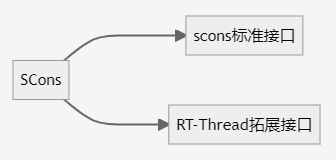
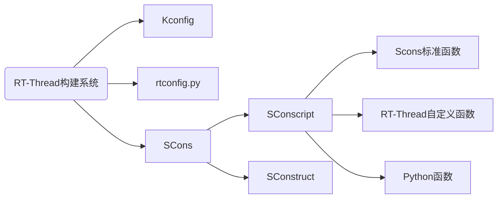
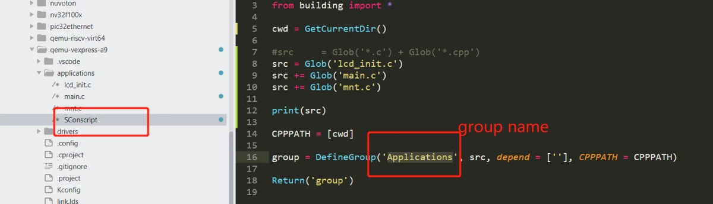

# SCons

## 1 构建工具（系统）

### 1.1 什么是构建工具（系统）

构建工具 (software construction tool) 是一种软件，它可以根据一定的规则或指令，将源代码编译成可执行的二进制程序。这是构建工具最基本也是最重要的功能。实际上构建工具的功能不止于此，通常这些规则有一定的语法，并组织成文件。这些文件用来控制构建工具的行为，在完成软件构建之外，也可以做其他事情。

目前最流行的构建工具是 GNU Make。很多知名开源软件，如 Linux 内核就采用 Make 构建。Make 通过读取 Makefile 文件来检测文件的组织结构和依赖关系，并完成 Makefile 中所指定的命令。

由于历史原因，Makefile 的语法比较混乱，不利于初学者学习。此外在 Windows 平台上使用 Make 也不方便，需要安装 Cygwin 环境。为了克服 Make 的种种缺点，人们开发了其他构建工具，如 CMake 和 SCons 等。

### 1.2 RT-Thread 构建工具

RT-Thread 早期使用 Make/Makefile 构建。从 RT-Thread 0.3.0 开始，RT-Thread 开发团队逐渐引入了 SCons 构建系统，引入 SCons 唯一的目是：使大家从复杂的 Makefile 配置、IDE 配置中脱离出来，把精力集中在 RT-Thread 功能开发上。

有些读者可能会有些疑惑，这里介绍的构建工具与 IDE 有什么不同呢？IDE 通过图形化界面的操作来完成构建。大部分 IDE 会根据用户所添加的源码生成类似 Makefile 或 SConscript 的脚本文件，在底层调用类似 Make 或 SCons 的工具来构建源码。

## 2 SCons 简介

SCons 是一套由 Python 语言编写的开源构建系统，类似于 GNU Make。它采用不同于通常 Makefile 文件的方式，而是使用 SConstruct 和 SConscript 文件来替代。这些文件也是 Python 脚本，能够使用标准的 Python 语法来编写。所以在 SConstruct、SConscript 文件中可以调用 Python 标准库进行各类复杂的处理，而不局限于 Makefile 设定的规则。

### 2.1 RT-Thread中Scons的脚本结构

SCons 使用 SConscript 和 SConstruct 文件来组织源码结构并进行构建，SConstruct是scons构建的主脚本，SConscript存放在源代码的子目录下，通常放在项目的子目录，以达到分层构建的目的。一个项目 (BSP) 只有一 SConstruct，但是会有多个 SConscript。一般情况下，每个存放有源代码的子目录下都会放置一个 SConscript。

```Markdown
/
  -- rtconfig.py    ---- 控制SCons构建的配置文件，存放了如工具链，构建参数等配置。
  -- SConscript
  -- SConstruct    ---- SCons的入口脚本，初始化了SCons构建rt-thread所需的必要环境
  -- Kconfig        ---- 顶层Kconfig文件，menuconfig的入口Kconfig文件
  -- rt-thread/
  --- src/
  ---- SConscript   ---- 各级源码的scons子脚本，控制当前级别下的源码构建行为
  ---- Kconfig      ---- 各级源码的Kconfig子脚本，存放当前级别下的配置项
  ---- **.c

```

如上图所示，为了方便开发者使用SCons，RT-Thread搭建了如图所示的构建框架，其中包括了一份SCons的入口脚本（SConstruct），以及分散在各级源码的SCons子脚本（SConscript），还有一份便于配置构建行为的配置脚本（rtconfig.py）同时，RT-Thread也在SCons标准接口的基础上，提供了一组用于组织源码工程的扩展接口。开发者在使用时，可以借助RT-Thread提供的扩展接口，更方便的完成源码的组织与配置。



为了使 RT-Thread 更好的支持多种编译器，以及方便的调整构建参数，RT-Thread 为每个 BSP 单独创建了一个名为 rtconfig.py 的配置文件。因此每一个 RT-Thread BSP 目录下都会存在下面三个文件：rtconfig.py、SConstruct 和 SConscript，它们控制 BSP 的构建。一个 BSP 中只有一个 SConstruct 文件，但是却会有多个 SConscript 文件，可以说 SConscript 文件是组织源码的主力军。

RT-Thread当前的构建系统由以下几个部分组成：



## 3 SCons 基本命令

RT-Thread 构建系统支持多种编译器。目前支持的编译器包括 ARM GCC、MDK、IAR、VisualStudio、Visual DSP。主流的 ARM Cortex M0、M3、M4 平台，基本上 ARM GCC、MDK、IAR 都是支持的。有一些 BSP 可能仅支持一种，读者可以阅读该 BSP 目录下的 rtconfig.py 里的 CROSS_TOOL 选项查看当前支持的编译器。

打开 Env 工具，如果是 ARM 平台的芯片，输入 scons 命令直接编译 BSP，这时候默认使用的是 ARM GCC 编译器，因为 Env 工具带有 ARM GCC 编译器。 如下图所示使用 `scons` 命令编译 BSP。


如果用户要使用其他的 BSP 已经支持的编译器编译工程，或者 BSP 为非 ARM 平台的芯片，那么不能直接使用 scons 命令编译工程，需要自己安装对应的编译器，并且指定使用的编译器路径。在编译工程前，可以在 Env 命令行界面使用下面的 2 个命令指定编译器为 MDK 和编译器路径为 MDK 的安装路径：

```c
set RTT_CC=keil
set RTT_EXEC_PATH=C:/Keilv5
```

再例如

```
set RTT_CC=gcc
set RTT_EXEC_PATH=D:\software\RaspberryPi-Pico\gcc\2020-q4-major\bin
```

### 3.1 scons

在 Env 命令行窗口进入要编译的 BSP 工程目录，然后使用此命令可以直接编译工程。如果执行过 `scons` 命令后修改了一些源文件，再次执行 scons 命令时，则 SCons 会进行增量编译，仅编译修改过的源文件并链接。

如果在 Windows 上执行 `scons` 输出以下的警告信息：

```c
scons: warning: No version of Visual Studio compiler found - C/C++ compilers most likely not set correctly.
```

说明 scons 并没在你的机器上找到 Visual Studio 编译器，但实际上我们主要是针对设备开发，和 Windows 本地没什么关系，请直接忽略掉它。

`scons` 命令后面还可以增加一个 - s 参数，即命令 `scons -s`，和 scons 命令不同的是此命令不会打印具体的内部命令。

### 3.2 scons -c

清除编译目标。这个命令会清除执行 scons 时生成的临时文件和目标文件。

### 3.3 scons --target=XXX

这个命令后面同样可以增加一个 -s 参数，如命令 `scons –target=mdk5 -s`，执行此命令时不会打印具体的内部命令。

> [!NOTE]
> 注：要生成 MDK 或者 IAR 的工程文件，前提条件是 BSP 目录存在一个工程模版文件，然后 scons 才会根据这份模版文件加入相关的源码，头文件搜索路径，编译参数，链接参数等。而至于这个工程是针对哪颗芯片的，则直接由这份工程模版文件指定。所以大多数情况下，这个模版文件是一份空的工程文件，用于辅助 SCons 生成 project.uvprojx 或者 project.eww。

#### 3.3.1 生成 Keil-MDK / IAR 工程

如果使用 MDK/IAR 来进行项目开发，在生成 MDK 或者 IAR 工程前，需要检查 rtconfig.py 文件中 `EXEC_PATH` 变量所保存的对应 IDE 的安装路径是否正确：


当修改了 rtconfig.h 打开或者关闭某些组件时，需要使用以下命令中的其中一种重新生成对应的定制化的工程，然后在 MDK/IAR 进行编译下载:

```c
scons --target=iar
scons --target=mdk4
scons --target=mdk5
```

在命令行窗口进入要编译的 BSP 工程目录，使用 `scons --target=mdk5`或者`scons --target=mdk4` 命令后会在 BSP 目录生成一个新的 MDK 工程文件名为 project.uvprojx。双击它打开，就可以使用 MDK 来编译、调试。使用 `scons --target=iar` 命令后则会生成一个新的 IAR 工程文件名为 project.eww。不习惯 SCons 的用户可以使用这种方式。如果打开 project.uvproj 失败，请删除 project.uvopt 后，重新生成工程。

#### 3.3.2 生成 CMake / Makefile 工程

对于习惯 CMake 或者 Makefile 的用户，可以通过以下两个命令来分别生成 CMake 和 Makefile 脚本：

```
scons --target=cmake
Scons --target=makefile
```

#### 3.3.3 生成 Vsiual Studio 工程

在 bsp/simulator 下，可以使用下面的命令生成 vs2012 的工程或 vs2005 的工程：

```c
scons --target=vs2012
Scons --target=vs2005
```

如果 BSP 目录下提供其他 IDE 工程的模板文件也可以使用此命令生成对应的新工程，比如 ua、vs、cb、cdk。

### 3.4 scons -jN

多线程编译目标，在多核计算机上可以使用此命令加快编译速度。一般来说一颗 cpu 核心可以支持 2 个线程。双核机器上使用 `scons -j4` 命令即可。

> [!NOTE]
> 注：如果你只是想看看编译错误或警告，最好是不使用 - j 参数，这样错误信息不会因为多个文件并行编译而导致出错信息夹杂在一起。

### 3.5 scons --dist

搭建项目框架，使用此命令会在  BSP 目录下生成 dist 目录，这便是开发项目的目录结构，包含了RT-Thread源码及BSP相关工程，不相关的BSP文件夹及libcpu都会被移除，并且可以随意拷贝此工程到任何目录下使用。

### 3.6 scons --dist-ide

可以将该BSP导出一份可以被 RT-Thread Studio 导入的工程文件夹，RT-Thread Studio 已经内置该功能，已无需手动敲这个命令。

### 3.7 scons --verbose

默认情况下，使用 scons 命令编译的输出不会显示编译参数，如下所示：

```c
D:\repository\rt-thread\bsp\stm32f10x>scons
scons: Reading SConscript files ...
scons: done reading SConscript files.
scons: Building targets ...
scons: building associated VariantDir targets: build
CC build\applications\application.o
CC build\applications\startup.o
CC build\components\drivers\serial\serial.o
...
```

使用 scons –verbose 命令的效果如下：

```c
armcc -o build\src\mempool.o -c --device DARMSTM --apcs=interwork -ID:/Keil/ARM/
RV31/INC -g -O0 -DUSE_STDPERIPH_DRIVER -DSTM32F10X_HD -Iapplications -IF:\Projec
t\git\rt-thread\applications -I. -IF:\Project\git\rt-thread -Idrivers -IF:\Proje
ct\git\rt-thread\drivers -ILibraries\STM32F10x_StdPeriph_Driver\inc -IF:\Project
\git\rt-thread\Libraries\STM32F10x_StdPeriph_Driver\inc -ILibraries\STM32_USB-FS
-Device_Driver\inc -IF:\Project\git\rt-thread\Libraries\STM32_USB-FS-Device_Driv
er\inc -ILibraries\CMSIS\CM3\DeviceSupport\ST\STM32F10x -IF:\Project\git\rt-thre
...
```

### 3.8 scons --buildlib

使用指令 scons --buildlib=xxx，其中 xxx 为 Group 的名字。

以 bsp/qemu-vexpress-a9 为例，在其 applications 目录有定义 Sconsript:



那么就可以输入 scons --buildlib=Applications，就可以将 Applications 这个 group 定义的 C 文件编译打包成一个静态库，输出也是位于 bsp 的目录中。


## 4 SCons 函数

本章节将介绍在使用编写 SConscript 脚本中常用的函数，包含 SCons 原生标准函数以及RT-Thread扩展的函数。关于 SCons 原生标准函数，在 [SCons](http://www.scons.org/doc/production/HTML/scons-user/index.html) 的网站上可以找到详细的 SCons 原生函数介绍。

### 4.1 Scons 原生标准函数

#### 4.1.1 Import(vars)

导入其他脚本定义的 vars ，这里的 vars 仅仅是一个变量名，它是一个字符串，其代表的可以是一个变量，也可以是一个变量列表

#### 4.1.2 Export(vars)

导出 vars ，以供 Import 函数在其他 SCons 脚本使用，同样，这里的 vars 仅仅是一个变量的名字，是一个字符串

#### 4.1.3 SConscript(scripts, \[exports, variant\_dir, duplicate])

读取新的 SConscript 文件，SConscript() 函数的参数描述如下所示：

| **参数**    | **描述**                                        |
| ----------- | ----------------------------------------------- |
| dirs        | 导入的SConscript，路径+名称                     |
| exports     | 导出一个变量（可选）                            |
| variant_dir | 指定生成的目标文件的存放路径（可选）            |
| duiplicate  | 设定是否拷贝或链接源文件到 variant_dir （可选） |

#### 4.1.4 Glob(pattern)

返回参与构建的对象，对象满足 pattern 模式匹配的列表。例如，获取当前 Sconscript 所在路径下的所有 .c 文件：

```python
src = Glob('*.c')
```

#### 4.1.5 IsDefined(depend)

判断宏是否被定义&#xA;参数：&#xA;depend：宏或宏列表&#xA;返回值：已定义为 True，否则为 False

#### 4.1.6 Split(str)

将字符串 str 分割成一个列表，例如：

```python
src     = Split('''
shell.c
msh.c
''')
```

上例中，也可以等效写成：

```python
src = ['shell.c', 'msh.c']
```

不推荐这么写：

```python
src = Glob('shell.c')
```

### 4.2 RT-Thread 自定义 Scons 函数

#### 4.2.1 SrcRemove(src, remove）

从构建列表中移除源文件&#xA;参数：&#xA;src：构建列表&#xA;remove：移除的源文件列表

#### 4.2.2 DefineGroup(name, src, depend, \*\*parameters)

定义一个参与构建的 Group ，并作为参与 Scons 构建的对象返回。Group 可以是一个目录（下的文件或子目录），也是后续一些 IDE 工程文件中的一个 Group 或文件夹。

| **参数**   | **描述**                                                     |
| ---------- | ------------------------------------------------------------ |
| name       | Group 的名字                                                 |
| src        | Group 中包含的文件，一般指的是 C/C++ 源文件。方便起见，也能够通过 Glob 函数采用通配符的方式列出 SConscript 文件所在目录中匹配的文件 |
| depend     | Group 编译时所依赖的选项（例如 FinSH 组件依赖于 RT_USING_FINSH 宏定义）。编译选项一般指 rtconfig.h 中定义的 RT_USING_xxx 宏。当在 rtconfig.h 配置文件中定义了相应宏时，那么这个 Group 才会被加入到编译环境中进行编译。如果依赖的宏并没在 rtconfig.h 中被定义，那么这个 Group 将不会被加入编译。相类似的，在使用 scons 生成为 IDE 工程文件时，如果依赖的宏未被定义，相应的 Group 也不会在工程文件中出现 |
| parameters | 配置其他参数，可取值见下表，实际使用时不需要配置所有参数     |

parameters 可加入的参数：

| 构建参数   | 意义                           |
| ---------- | ------------------------------ |
| CCFLAGS    | C/CPP 源文件公共编译参数       |
| CFLAGS     | C 源文件独有编译参数           |
| CXXFLAGS   | CPP 源文件独有编译参数         |
| CPPPATH    | 头文件路径                     |
| CPPDEFINES | 编译时添加宏定义，即全局宏定义 |
| LIBRARY    | 是否将Group构建为静态库        |

#### 4.2.3 GetCurrentDir()

获取当前脚本所在路径，例如：

```python
cwd     = GetCurrentDir() # 获取当前脚本的路径
```

#### 4.2.4 GetDepend(depend)

查看是否定义了宏依赖，例如：

```python
if GetDepend('MSH_USING_BUILT_IN_COMMANDS'): # 判断是否启用MSH的内建命令
    src += ['cmd.c']
```

#### 4.2.5 AddDepend(option)

添加一个宏定义。 &#xA;参数：&#xA;option：添加的宏

#### 4.2.6 GetConfigValue(name)

获得配置的值（宏定义的值）。&#xA;参数：&#xA;name：宏定义

#### 4.2.7 GetVersion()

获得RTT版本信息

#### 4.2.8 GlobSubDir(sub_dir, ext_name)

对目录下所有文件（包含子目录）进行 Glob

#### 4.2.9 BuildPackage(package)

按照 json 提供的格式，定义一个 Group。 &#xA;参数：&#xA;package：json 文件

### 4.3 Python 函数

Sconscript 脚本中可以使用任何 Python 库函数，使用方式和正常的 Python 脚本无异。这也是 Scons 构建工具强大之处所在，可以借助 Python 灵活的语法和丰富的库，完成 CMake 或者 Makefile 无法做到的事情。例如可以导入 os 标准库，实现对文件和目录的相关操作。


## 5 Scons 函数在 SConscript 中的经典示例

下面我们将以几个 SConscript 为例讲解 scons 构建工具的使用方法。

### 5.1 构建一个基本的 Group

```python
# 导入RT-Thread的自定义构建函数，几乎每一个RT-Thread的Sconscript都需要这么做。
# 只有导入了building模块，才可以使用2.2.2介绍的RT-Thread自定义Scons函数
from building import * 

cwd     = GetCurrentDir() # 获取当前脚本的路径
CPPPATH = [cwd] # 将当前路径加入构建搜索的头文件路径
src     = Split('''
shell.c
msh.c
''')

#也可以等效成：src = ['shell.c', 'msh.c']

if GetDepend('MSH_USING_BUILT_IN_COMMANDS'): # 判断是否启用MSH的内建命令
    src += ['cmd.c']

if GetDepend('DFS_USING_POSIX'): # 判断是否启用文件系统的POSIX接口
    src += ['msh_file.c']

# 使用DefineGroup创建一个名为Finsh的组
# 该Group是否被添加到工程中，参与编译，取决于depend的宏是否在Kconfig中被使能。
# 即上述的头文件路径和C文件是否被编译，取决于用户在Kconfig中是否使能了RT_USING_FINSH
group = DefineGroup('Finsh', src, depend = ['RT_USING_FINSH'], CPPPATH = CPPPATH) 

Return('group') # 将当前脚本指定的构建对象返回上级SCons脚本
```

这里需要注意：

1. src 和 depends参数是必选项，即便你不想添加任何C文件，也需要定义一个空的列表。例如：

   ```python
   src = []
   group = DefineGroup('Finsh', src, depend = [''], CPPPATH = CPPPATH) 
   ```

2. 头文件路径的参数不是必选项，如果不想添加头文件目录，就不需要填写 `CPPPATH` 参数

3. 最后一行使用 DefineGroup 创建一个名为 Finsh 的组，这个组也就对应 MDK 或者 IAR 中的分组。这个组的源代码文件为 src 指定的文件，如果 depend 为空表示该组不依赖任何 rtconfig.h 的宏。

4. `CPPPATH =CPPPATH` 表示将当前路径添加到系统的头文件路径中。左边的 CPPPATH 是 DefineGroup 中内置参数，表示头文件路径。右边的 CPPPATH 是本文件上面一行定义的。这样我们就可以在其他源码中引用 drivers 目录下的头文件了。

5. 如果有其他 Sconscript 文件也创建了相同的组名（例如，都叫 `Finsh`），Scons 会自动将这两个组的信息并入到一起。

### 5.2 桥接文件

在一些文件夹内的 Sconscript 脚本中，会发现有如下的代码。这些代码并没有实际去将某些C文件或者头文件路径加入到工程中。它所起到的作用是桥接，即让 Scons 继续读取其子文件夹内的 Sconscript 脚本，进而继续构建工程：

```python
# RT-Thread building script for bridge

import os # 使用Python标准库，用于文件以及路径相关的操作
from building import *

cwd = GetCurrentDir()
objs = []
list = os.listdir(cwd)

for d in list:
    path = os.path.join(cwd, d)
    if os.path.isfile(os.path.join(path, 'SConscript')):
        objs = objs + SConscript(os.path.join(d, 'SConscript'))

Return('objs')
```

### 5.3 全局宏定义的定义

下面的代码展示了如何定义全局宏定义：

```python
from building import *

src = ['ipc.c'] # 添加C文件

CPPDEFINES = ['__RTTHREAD__'] # 全局宏定义

# depend 为空表示该组不依赖任何 rtconfig.h 的宏
group = DefineGroup('Kernel', src, depend = [''], CPPDEFINES = CPPDEFINES)

Return('group')
```

所谓全局宏定义，就是即便不引用任何 RT-Thread 的头文件，你也可以使用直接使用 `__RTTHREAD__` 这个宏定义。

### 5.4 与编译器相关

如下的 Sconscript 脚本展示了如何判断不同的编译器，并根据不同的编译器来进行不同的处理：

```python
if rtconfig.CROSS_TOOL == 'iar': # 判断是否使用IAR编译器
if rtconfig.CROSS_TOOL == 'keil': # 判断是否使用Keil编译器
if rtconfig.CROSS_TOOL == 'msvc': # 判断是否使用Visual Studio编译器
if rtconfig.PLATFORM == 'armcc': # 判断是否使用Keil-AC5，即armcc编译工具链
if rtconfig.PLATFORM == 'armclang': # 判断是否使用Keil-AC6，即armclang编译工具链
if rtconfig.PLATFORM == 'iar': # 判断是否使用IAR编译器的工具链
if rtconfig.PLATFORM == 'gcc': # 判断是否使用gcc编译工具链
```

下面的例子中，展示了针对不同的编译器/工具链，来进行设置不同的编译标志：

源码位置：https://github.com/mysterywolf/RTduino/blob/master/core/SConscript

```python
from building import *
import rtconfig

cwd = GetCurrentDir()
src = Glob('*.c') + Glob('*.cpp')
inc = [cwd]

LOCAL_CCFLAGS = ''
LOCAL_CFLAGS = ''
LOCAL_CXXFLAGS = ''

if rtconfig.PLATFORM == 'gcc' or rtconfig.PLATFORM == 'armclang': # GCC or Keil AC6
    LOCAL_CFLAGS += ' -std=c99'
    LOCAL_CXXFLAGS += ' -std=c++11' # support C++11, like non-static data member initializers
elif rtconfig.PLATFORM == 'armcc': # Keil AC5
    LOCAL_CCFLAGS += ' --gnu -g -W'
    LOCAL_CFLAGS += ' --c99' # cannot use --c99 symbol for C++ files, pertically in Keil
    LOCAL_CXXFLAGS += ' --cpp11' # support C++11

group = DefineGroup('Arduino', src,
                     depend = ['PKG_USING_RTDUINO'],
                     CPPPATH = inc,
                     CPPDEFINES = ['ARDUINO=100', 'ARDUINO_ARCH_RTTHREAD'],
                     LOCAL_CCFLAGS = LOCAL_CCFLAGS,
                     LOCAL_CFLAGS = LOCAL_CFLAGS,
                     LOCAL_CXXFLAGS = LOCAL_CXXFLAGS)

Return('group')
```

### 5.5 添加模块

前文提到在自己源代码文件不多的情况下，建议所有源代码文件都放在 applications 文件夹里面。如果用户源代码很多了，并且想创建自己的工程模块，或者需要使用自己获取的其他模块，怎么做会比较合适呢？

同样以上文提到的 hello.c 和 hello.h 为例，这两个文件将会放到一个单独的文件夹里管理，并且在 MDK 工程文件里有自己的分组，且可以通过 menuconfig 选择是否使用这个模块。在 BSP 下新增 hello 文件夹。


大家注意到文件夹里多了一个 SConscript 文件，如果想要将自己的一些源代码加入到 SCons 编译环境中，一般可以创建或修改已有的 SConscript 文件。参考上文对 RT-Thread 源代码的一些对 SConscript 文件的分析，这个新增的 hello 模块 SConscript 文件内容如下所示：

```c
from building import *

cwd          = GetCurrentDir()
include_path = [cwd]
src          = []

if GetDepend(['RT_USING_HELLO']):
    src += ['hello.c']

group = DefineGroup('hello', src, depend = [''], CPPPATH = include_path)

Return('group')
```

通过上面几行简单的代码，就创建了一个新组 hello，并且可以通过宏定义控制要加入到组里面的源文件，还将这个组所在的目录添加到了系统头文件路径中。那么自定义宏 RT_USING_HELLO 又是通过怎样的方式定义呢？这里要介绍一个新的文件 Kconfig。Kconfig 用来配置内核，使用 Env 配置系统时使用的 menuconfig 命令生成的配置界面就依赖 Kconfig 文件。menuconfig 命令通过读取工程的各个 Kconfig 文件，生成配置界面供用户配置内核，最后所有配置相关的宏定义都会自动保存到 BSP 目录里的 rtconfig.h 文件中，每一个 BSP 都有一个 rtconfig.h 文件，也就是这个 BSP 的配置信息。

在 stm32f10x-HAL BSP 目录下已经有了关于这个 BSP 的 Kconfig 文件，我们可以基于这个文件添加自己需要的配置选项。关于 hello 模块添加了如下配置选项，# 号后面为注释。


使用 Env 工具进入 stm32f10x-HAL BSP 目录后，使用 menuconfig 命令在主页面最下面就可以看到新增的 hello 模块的配置菜单，进入菜单后如下图所示。


还可以修改 hello value 的值。


保存配置后退出配置界面，打开 stm32f10x-HAL BSP 目录下的 rtconfig.h 文件可以看到 hello 模块的配置信息已经有了。


**注意：每次 menuconfig 配置完成后都要使用 scons --target=XXX 命令生成新工程。**

因为 rtconfig.h 中已经定义了 RT_USING_HELLO 宏，所以新生成工程时就会把 hello.c 的源文件添加到新工程中。

上面只是简单列举了在 Kconfig 文件中添加自己模块的配置选项，用户还可以参考[《Env 用户手册》](../env/env.md)，里面也有对配置选项修改和添加的讲解，也可以自己百度查看 Kconfig 的相关文档，实现其他更复杂的配置选项。

### 5.6 添加库

如果要往工程中添加一个额外的库，需要注意不同的工具链对二进制库的命名。

* ARMCC 工具链下的库名称应该是 xxx.lib，一个以 .lib 为后缀的文件。
* IAR 工具链下的库名称应该是 xxx.a，一个以 .a 为后缀的文件。
* GCC 工具链下的库名称应该是 libxxx.a，一个以 .a 为后缀的文件，并且有 lib 前缀。

ARMCC / IAR 工具链下，若添加库名为 libabc.lib / libabc_iar.a 时，在指定库时指定全名 libabc。

GCC 工具链比较特殊，它识别的是 libxxx.a 这样的库名称，若添加库名为 libabc.a 时，在指定库时是指定 abc，而不是 libabc。

例如，`/libs` 下有以下库文件需要添加：

```
libabc_keil.lib
libabc_iar.a
libabc_gcc.a
```

则对应的 SConscript 如下：

```python
Import('rtconfig')
from building import *

cwd = GetCurrentDir()
src = Split('''
''')

LIBPATH = [cwd + '/libs']             # LIBPATH 指定库的路径，表示库的搜索路径是当前目录下的'libs'目录

if rtconfig.CROSS_TOOL == 'gcc':
    LIBS = ['abc_gcc']                    # GCC 下 LIBS 指定库的名称
elif rtconfig.CROSS_TOOL == 'keil':
    LIBS = ['libabc_keil']                # ARMCC 下 LIBS 指定库的名称
else:
    LIBS = ['libabc_iar']                 # IAR 下 LIBS 指定库的名称

group = DefineGroup('ABC', src, depend = [''], LIBS = LIBS, LIBPATH=LIBPATH)

Return('group')
```

## 6 编译器选项 (rtconfig.py)

rtconfig.py 是一个 RT-Thread 标准的编译器配置文件，控制了大部分编译选项，是一个使用 python 语言编写的脚本文件，主要用于完成以下工作：

* 指定编译器（从支持的多个编译器中选择一个你现在使用的编译器）。

* 指定编译器参数，如编译选项、链接选项等。

当我们使用 scons 命令编译工程时，就会按照 rtconfig.py 的编译器配置选项编译工程。下面的代码为 stm32f10x-HAL BSP 目录下 rtconfig.py 的部分代码。

```c
import os

# toolchains options
ARCH='arm'
CPU='cortex-m3'
CROSS_TOOL='gcc'

if os.getenv('RTT_CC'):
    CROSS_TOOL = os.getenv('RTT_CC')

# cross_tool provides the cross compiler
# EXEC_PATH is the compiler execute path, for example, CodeSourcery, Keil MDK, IAR

if  CROSS_TOOL == 'gcc':
    PLATFORM    = 'gcc'
    EXEC_PATH   = '/usr/local/gcc-arm-none-eabi-5_4-2016q3/bin/'
elif CROSS_TOOL == 'keil':
    PLATFORM    = 'armcc'
    EXEC_PATH   = 'C:/Keilv5'
elif CROSS_TOOL == 'iar':
    PLATFORM    = 'iar'
    EXEC_PATH   = 'C:/Program Files/IAR Systems/Embedded Workbench 6.0 Evaluation'

if os.getenv('RTT_EXEC_PATH'):
    EXEC_PATH = os.getenv('RTT_EXEC_PATH')

BUILD = 'debug'

if PLATFORM == 'gcc':
    # toolchains
    PREFIX = 'arm-none-eabi-'
    CC = PREFIX + 'gcc'
    AS = PREFIX + 'gcc'
    AR = PREFIX + 'ar'
    LINK = PREFIX + 'gcc'
    TARGET_EXT = 'elf'
    SIZE = PREFIX + 'size'
    OBJDUMP = PREFIX + 'objdump'
    OBJCPY = PREFIX + 'objcopy'

    DEVICE = '-mcpu=cortex-m3 -mthumb -ffunction-sections -fdata-sections'
    CFLAGS = DEVICE
    AFLAGS = '-c' + DEVICE + '-x assembler-with-cpp'
    LFLAGS = DEVICE + '-Wl,--gc-sections,-Map=rtthread-stm32.map,-cref,-u,Reset_Handler -T stm32_rom.ld'
```

其中 CFLAGS 是 C 文件的编译选项，AFLAGS 则是汇编文件的编译选项，LFLAGS 是链接选项。BUILD 变量控制代码优化的级别。默认 BUILD 变量取值为'debug'，即使用 debug 方式编译，优化级别 0。如果将这个变量修改为其他值，就会使用优化级别 2 编译。下面几种都是可行的写法（总之只要不是'debug'就可以了)。

```c
BUILD = ''
BUILD = 'release'
BUILD = 'hello， world'
```

建议在开发阶段都使用 debug 方式编译，不开优化，等产品稳定之后再考虑优化。

关于这些选项的具体含义需要参考编译器手册，如上面使用的 armcc 是 MDK 的底层编译器。其编译选项的含义在 MDK help 中有详细说明。

前文提到过如果用户执行 scons 命令时希望使用其他编译器编译工程，可以在 Env 的命令行端使用相关命令指定编译器和编译器路径。但是这样修改只对当前的 Env 进程有效，再次打开时又需要重新使用命令设置，我们可以直接修改 rtconfig.py 文件达到永久配置编译器的目的。一般来说，我们只需要修改 CROSS_TOOL 和下面的 EXEC_PATH 两个选项。

* CROSS_TOOL：指定编译器。可选的值有 keil、gcc、iar，浏览 rtconfig.py 可以查看当前 BSP 所支持的编译器。如果您的机器上安装了 MDK，那么可以将 CROSS_TOOL 修改为 keil，则使用 MDK 编译工程。

* EXEC_PATH：编译器的安装路径。这里有两点需要注意：

安装编译器时（如 MDK、GNU GCC、IAR 等），不要安装到带有中文或者空格的路径中。否则，某些解析路径时会出现错误。有些程序默认会安装到 `C:\Program Files` 目录下，中间带有空格。建议安装时选择其他路径，养成良好的开发习惯。

修改 EXEC_PATH 时，需要注意路径的格式。在 windows 平台上，默认的路径分割符号是反斜杠 `“\”`，而这个符号在 C 语言以及 Python 中都是用于转义字符的。所以修改路径时，可以将`“\”` 改为 `“/”`，或者在前面加 r（python 特有的语法，表示原始数据）。

假如某编译器安装位置为 `D:\Dir1\Dir2` 下。下面几种是正确的写法:

* EXEC_PATH = `r'D:\Dir1\Dir2'`  注意，字符串前带有 r，则可正常使用 `“\”`。

* EXEC_PATH = `'D:/Dir1/Dir2'`   注意，改用 `“/”`，前面没有 r。

* EXEC_PATH = `'D:\\Dir1\\Dir2'` 注意，这里使用 `“\”` 的转义性来转义 `“\”` 自己。

* 这是错误的写法：EXEC_PATH = `'D:\Dir1\Dir2'`。

如果 rtconfig.py 文件有以下代码，在配置自己的编译器时请将下列代码注释掉。

```c
if os.getenv('RTT_CC'):
    CROSS_TOOL = os.getenv('RTT_CC')
... ...
if os.getenv('RTT_EXEC_PATH'):
    EXEC_PATH = os.getenv('RTT_EXEC_PATH')
```

上面 2 个 if 判断会设置 CROSS_TOOL 和 EXEC_PATH 为 Env 的默认值。

编译器配置完成之后，我们就可以使用 SCons 来编译 RT-Thread 的 BSP 了。在 BSP 目录打开命令行窗口，执行 `scons` 命令就会启动编译过程。

## 7 其他

### 7.1 RT-Thread 辅助编译脚本

在 RT-Thread 源代码的 tools 目录下存放有 RT-Thread 自己定义的一些辅助编译的脚本，例如用于自动生成 RT-Thread 针对一些 IDE 集成开发环境的工程文件。其中最主要的是 building.py 脚本。

### 7.2 SCons 更多使用

对于复杂、大型的系统，显然不仅仅是一个目录下的几个文件就可以搞定的，很可能是由数个文件夹一级一级组合而成。

在 SCons 中，可以编写 SConscript 脚本文件来编译这些相对独立目录中的文件，同时也可以使用 SCons 中的 Export 和 Import 函数在 SConstruct 与 SConscript 文件之间共享数据（也就是 Python 中的一个对象数据）。更多 SCons 的使用方法请参考 [SCons 官方文档](https://scons.org/documentation.html)。
