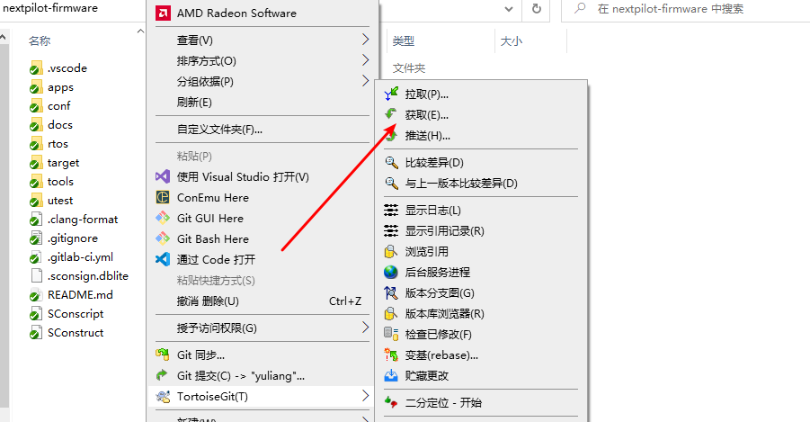

# 基础知识

## 常用操作

在日常开发中，需要经常提交自己的开发代码（无需完成一个模块才提交），特别是在下班前；当需要将自己的分支代码合并到主分支（main）时，需要做变基处理。

### 获取远端信息

首先，需要将远端的分支信息拉取到本地，方法如下：

```
git fetch
```



### 进行变基操作

将本地分支变基到远端的最新main分支，在变基过程中如果有冲突，需要手动解决：

```
git rebase origin/main
```


### 删除远端分支

由于变基后，本地的开发者分支的时间节点落后于远端分支的时间节点，现在推送本地分支到远端会失败，因此在推送分支前需要删除远端分支。方法如下：

```
git push origin --delete <你的分支名称>
```


### 提交到远端

变基并删除远端分支之后，就可以将本地分支推动到远端了：

```
git push
```


