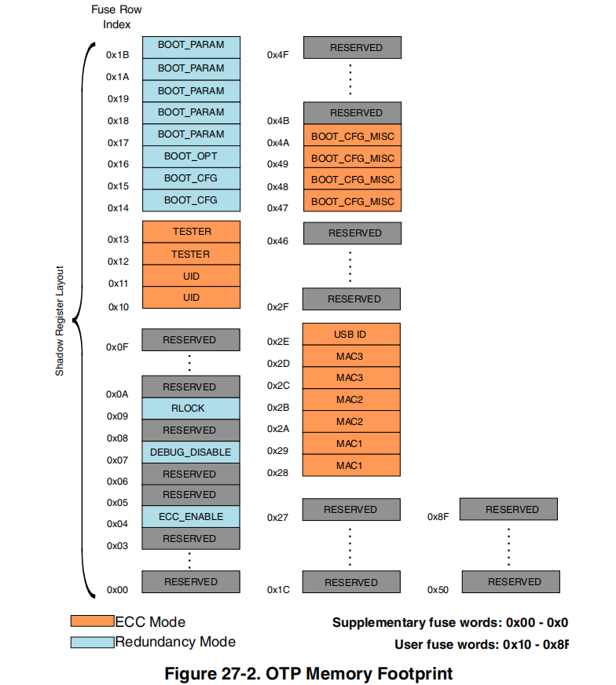
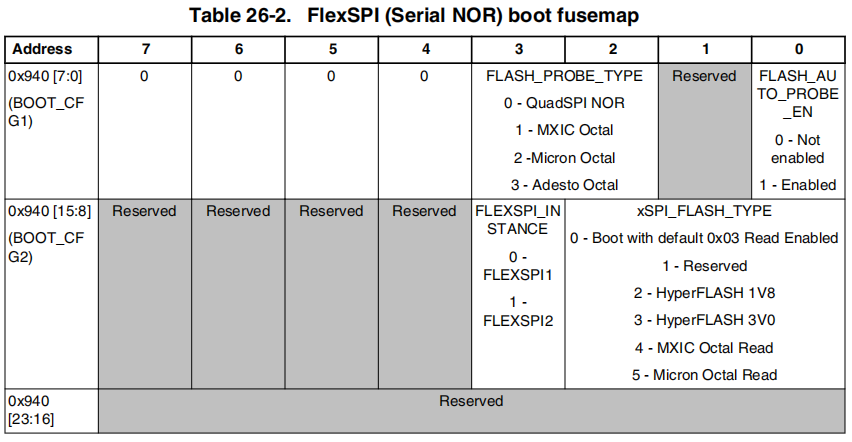
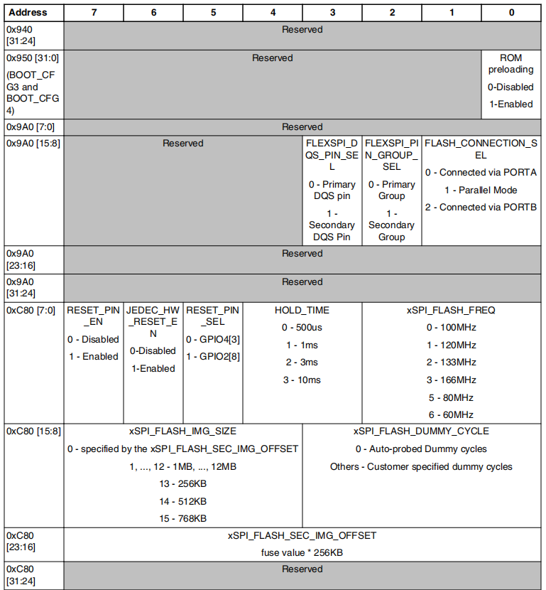

# 系统启动

I.MXRT1170 系列单片机，内部固化了最基础的“开机程序”，也就是 [BootROM](#boot-rom)。你一上电，BootROM 永远第一个醒来，但这时候它两眼一抹黑：该从哪里找你的主程序？是旁边的 NOR Flash，还是 SD 卡，或者是通过串口送进来？找到了程序，又该怎么把它搬到合适的地方跑起来？这一连串的问题，都需要一套明确的“行动指南”。

这套指南，就藏在芯片的启动模式（[BOOT_MODE](#boot-mode)）、OPT熔丝（[eFUSE](#opt-efuse)）、引脚配置（[BOOT_CFG](#boot-cfg)）和你精心准备的程序镜像（[Bootable Image](#bootable-image)）里。整个流程环环相扣，任何一个环节配置错了，你的板子就可能“变砖”，或者卡在启动的门口死活进不去。所以，理解它，不仅是学习知识，更是实战调试的必备技能。

不少工程师，程序编译得好好的，一下载进去就不运行，最后折腾半天发现是启动头没配置对。所以，咱们今天的目标就是让你彻底搞懂这套流程，以后遇到启动问题，能自己顺藤摸瓜找到原因。咱们先不急着看代码，先从宏观上把握几个核心角色：负责发号施令的 BootROM、提供硬件配置信息的 BOOT_CFG 引脚和熔丝 eFuse、以及承载你心血的那个最终的可启动镜像（Bootable Image）文件。

本文主要参考 [i.MX RT1170 Processor Reference Manual](./IMXRT1170RM.pdf) 中 `Chapter 10 System Boot` 章节，来讲解 `RT1170` 的系统启动流程。

## BOOT ROM

Boot是任何一款MCU都有的特性。提及Boot，首先应该联想到的是FLASH，通常Cortex-M微控制器芯片内部一般都会集成FLASH（从FLASH分类上来看应该属于Parallel NOR FLASH），你的Application代码都是保存在FLASH里，每次上电CPU会自动从FLASH里获取Application代码并执行，这个行为就是Boot。

I.MXRT1170 系列 BootROM 其实是芯片在出厂前固化在 ROM 里的一段 Bootloader 程序（__不可改变和擦除__）。这个 Bootloader 程序可以帮助你完成 Flash 里的 Application 的更新，而不需要使用额外的外部编程/调试器（比如JLink），也可以完成 Application 的启动。

!!! note
    - BootROM 是工厂一次性掩膜固化的片内 ROM，物理只读，没有擦写电路，任何工具（J-Link、MfgTool、MCUBootUtility、SDP 协议）都无法修改、升级、替换 BootROM 固件，__也就是出厂版本终身固定__。不过 NXP 给 i.MX RT 系列预留了eFuse ROM 补丁入口，仅用于修复 ROM 少量已知硬件 Bug，属于运行时内存替换，无法整体更新 BootROM。
    - i.MX RT1170系列 BootROM 物理内存映射地址范围：`0x0000_0000 ~ 0x0003_FFFF`（共 `0x40000` 字节，256 KB），注意 BootROM 执行完毕后会将`0x0000_0000 ~ 0x0003_FFFF`重新映射为 `ITCM`  使用。

根据参考手册`10.2 Overview`章节，可知 BootROM 可以帮助你完成：

- 支持从多种启动存储设备启动，比如Nor Flash、 NAND Flash、eMMC等
- 内置串行下载器，用来更新程序（不需要使用Jlink等调试器），支持 USB-HID、UART 两种下载通道
- 设备配置数据（DCD，BootROM 外设 / 内存初始化指令段）
- 基于数字签名的高可信安全启动（HAB，NXP 原厂安全启动框架）
- 外部内存配置数据（XMCD，DDR / 外部 RAM 时序初始化配置）
- 通过 FlexSPI 接口实现串行 NOR Flash 加密原地执行（XIP），由以下硬件引擎提供支持：
    - 内嵌式硬件加密引擎（IEE）
    - 实时 AES 硬件解密引擎（OTFAD，片上硬件流解密，读取 Flash 时自动解密）

当芯片复位触发后，启动流程正式开始，硬件复位逻辑强制 ARM 内核从片内 BootROM 开始执行代码：

1. 首先 BootROM 根据熔丝位 `BT_CORE_SEL` 的配置决定从 M7 还是 M4 核启动：若 `BT_CORE_SEL = 1` （默认是 0），BootROM 将由 M4 内核执行，而非默认 M7 内核。因为 M4 运行 ROM 代码的执行效率更低，因此从 M4 内核启动的速度会更慢，若开启 HAB 高可信启动功能，耗时差异会尤为明显。

2. 接着 BootROM 代码会读取内部寄存器 BOOT_MODE[1:0] 的电平状态，同时结合各类 eFUSE 熔丝配置、BOOT_CFG 引脚电平（开发阶段BOOT_CFG引脚电平可以覆盖eFuse设置），综合判定芯片的完整启动流程分支。

## BOOT Device

BootROM 支持从以下外设启动 Application 程序：

- Serial NOR Flash via FlexSPI
- Serial NAND Flash via FlexSPI
- SLC RAWNAND Flash via SEMC
- SD/MMC via uSDHC
- SPI NOR/EEPROM via LPSPI

## BOOT MODE 和 BT_FUSE_SEL

`BOOT_MODE` 和 `BT_FUSE_SEL` 联合起来告诉 BootROM 本次启要执行什么“模式的行动”。

!!! info
    - BOOT_MODE 由片内 `SRC_SBMR2` 寄存器 BMOD[1:0] 位的数值决定。当上电复位信号 POR_B 上升沿阶段，芯片会采集 BOOT_MODE0（复用引脚GPIO_LPSR_02）与 BOOT_MODE1（复用引脚GPIO_LPSR_03）两个引脚的电平，以此完成 SRC_SBMR2.BMOD[1:0]（SRC_SBMR2[25:24]） 寄存器的初始化。引脚电平采集完成后，后续引脚状态变化将不再改变片内 SRC_SBMR2.BMOD[1:0] 寄存器的值。
    - BT_FUSE_SEL 是 eFUSE 一次性熔丝烧入，出厂默认0，可以通过 SRC_SBMR2[20] 寄存器读取。

| BOOT_MODE | 引脚 | 寄存器 | 说明 |
| --- | --- | --- | --- |
| BOOT_MODE0 | GPIO_LPSR_02 | SRC->SBMR2.BMOD[0]，bit24 | 从引脚读取 |
| BOOT_MODE1 | GPIO_LPSR_03 | SRC->SBMR2.BMOD[1]，bit25 | 从引脚读取 |

`SRC_SBMR2 是 32 位只读寄存器，其中Bit25~24 => BOOT_MOD[1:0]，Bit20 => BT_FUSE_SEL`，可以使用以下代码，读取启动模式 BOOT_MODE：

```c
// 读取启动模式
uint32_t sbmr2 = SRC->SBMR2;
uint8_t boot_mode = (sbmr2 >> 24U) & 0x3U; // 提取BMOD[1:0]

switch(boot_mode)
{
    case 0: // Boot From Fuses
        break;
    case 1: // Serial Downloader
        break;
    case 2: // Internal Boot
        break;
    case 3: // Reserved
        break;
}
```

RT1170 共提供 4 种启动模式：熔丝启动、串行下载器启动、片内内置启动、预留。各模式启动行为详见下表：

| BOOT_MODE[1:0] | 启动方式 | 说明 |
| --- | --- | --- |
| 00 | Boot From Fuses，从熔丝启动，一般用于量产阶段 | BootROM 完全忽略 BOOT_CFG 引脚配置，直接根据 eFUSE 的配置决定如何启动：<br />1. BT_FUSE_SEL=0，自动进入串行下载，这个状态没有实际意义和使用价值，就算下载了程序，每次重启还是停留在串行下载，而不会运行Flash上的程序<br />2. BT_FUSE_SEL=1 ，根据 eFUSE 进行启动，用于量产阶段 |
| 01 | Serial Downloader，串行下载 | 这是一个“救援”和“烧录”模式。BootROM 初始化 USB 或 UART1 接口，等待主机（你的电脑）通过特定协议发送数据（比如flashloader）并写 RAM，然后通过 falshloader下载 app 到 flash，注意 BootROM 不具备直接将 app 写 Flash的能力，需要flashloader |
| 10 | Internal Boot，从内部启动，一般用于开发阶段 | BootROM 根据 BT_FUSE_SEL 的值决定选择哪个配置来启动：<br />1. BT_FUSE_SEL=0，按照 BOOT_CFG 引脚启动，用于开发阶段<br />2. BT_FUSE_SEL=1，按照 eFUSE 进行启动，类似量产阶段 |
| 11 | Reserved | 保留模式 |

### Boot From Fuses

　　Boot From Fuses 模式从名字来看其实会让人误解，这个模式并不是从 eFuse 里加载 Application 启动的意思，而是根据 eFuse 里的一些 Boot 配置值来决定从哪个外部存储器Boot。eFuse 是 i.MXRT1xxx里一块特殊的存储区域，用于存放全部芯片配置信息，其中有一部分配置信息和 Boot 相关。

　　在参考手册Fusemap这一章节，可以看到完整的Fuse Map表，其中偏移 `0x460` 处的 32bit 配置数据的 bit4 是 `BT_FUSE_SEL`，这个bit至关重要，决定了Boot From Fuses模式的主要行为，具体表现如下：

- `BT_FUSE_SEL=0`：表明所有外部存储器中均没有 Application，此时 Boot From Fuses 模式等同于 Serial Downloader 模式。
- `BT_FUSE_SEL=1`：表明有外部存储器中存在有效 Application，此时 BootROM 会根据 eFuse 中其他 Boot 配置信息进一步选择指定的外部存储器（Boot Device）去Boot。

### Serial Downloader

Serial Downloader 模式顾名思义即串行下载模式，在这种模式下，BootROM 通过指定的USB或者UART口来接收来自Host（恩智浦提供了上位机工具 sdphost.exe 或者 mfgtool 或者 MCUBootUtility）的 Application 数据，并将数据存储在 SRAM 中执行，__这种模式其实就是从SRAM启动__，但是如果用这种模式去 Boot Application 缺点很明显，每次上电都需要将 Application 重新下载进 SRAM，无法做到脱机自动 Boot，所以显然这种模式的主要目的并不是从 SRAM 启动 Application，那它到底有什么用？

其实 Serial Downloader 模式主要是用来从 SRAM中 启动 Flashloader，恩智浦官方提供了 Flashloader 程序，Flashloader 程序可以用来将你的 Application 下载进 i.MXRT1xxx 支持的所有外部非易失性存储器中，为后续从外部存储器启动做准备。除此以外 Serial Downloader 模式还可以用来查看 eFuse 值。

### Internal Boot

Internal Boot模式其实跟Boot From Fuses模式（BT_FUSE_SEL=1时）很类似，只是这个模式下BT_FUSE_SEL的意义有点不同，具体表现如下：

- `BT_FUSE_SEL=0`：BootROM根据BOOT_CFG[x:0] pins和Fuse中Boot配置综合决定Boot Device，其中BOOT_CFG[x:0] pins的配置会覆盖Fuse中意义相同的Boot配置信息。
- `BT_FUSE_SEL=1`：BootROM完全根据Fuse中Boot配置信息选择指定的Boot Device去Boot。

我们可以通过更改BOOT_CFG[x:0] pins输入状态来切换Boot配置，这部分Boot配置在Fuse里也同样存在，但是使用BOOT_CFG[x:0]来更改Boot配置显然比烧写Fuse更方便快捷（也可以认为BOOT_CFG[x:0]主要用于产品开发过程中，待产品开发结束后，应直接用Fuse来锁定Boot配置）。

## BOOT CFG 和 eFUSE

BOOT_CFG 是一组专用的GPIO引脚（例如RT1170上的GPIO_AD_00到GPIO_AD_07等）。在上电复位时，BootROM 会立刻采样这些引脚的电平状态，并将其解读为一组配置字。eFUSE 是内嵌的一块OTP(One time Programmable) memory，其中有一部分 eFUSE 位，其定义和 BOOT_CFG 引脚完全一样。在 `BOOT_MODE=10b 且 BT_FUSE_SEL=0` 时，BOOT_CFG 能够 覆盖 eFUSE 的配置，即：

- `BOOT_MODE=10b 且 BT_FUSE_SEL=0`时，BOOT_CFG 引脚的电平覆盖 eFUSE 的配置，BootROM 根据 BOOT_CFG 引脚启动，用电阻配置 BOOT_CFG 引脚，灵活方便，一般用户开发阶段。
- `BOOT_MODE=10b 且 BT_FUSE_SEL=1`时，BootROM 不再看 BOOT_CFG 引脚了，直接读 eFUSE 熔丝里的配置吧！ 把确定好的配置烧进 eFUSE，这样就能防止生产焊接或用户误触改变启动方式，提高了可靠性，一般用于量产阶段。

### BOOT CFG

BOOT_CFG 是一组专用的GPIO引脚（例如RT1170上的GPIO_AD_00到GPIO_AD_07等）。在上电复位时，BootROM 会立刻采样这些引脚的电平状态，并将其解读为一组配置字。这组配置里面至少包含了以下关键信息：

- 启动设备类型（BOOT_CFG1[7:4]）：是从串行NOR Flash（FlexSPI）启动，还是从NAND Flash（SEMC），或者是从SD卡启动？
- 接口实例和配置（BOOT_CFG2[3]）：如果是FlexSPI，用的是哪个实例（FlexSPI1还是FlexSPI2），Flash是几线制的（1-bit, 2-bit, 4-bit, 8-bit）
- 其他设备参数：比如NAND Flash的页大小、ECC配置等。

BOOT_CFG[x:0] 引脚其实是跟 eFuse 里是偏移 `0x450`处 32bit 配置数据里的 bit0-x 是对应的：

- BOOT_CFG[7:0] 引脚对应的是 eFuse BOOT_CFG1[7:0]
- BOOT_CFG[11:8] 引脚对应的是 eFuse BOOT_CFG2[3:0]

其中 BOOT_CFG1[7:4] 用于选择具体 Boot Device：

- 0000b – FlexSPI(Serial NOR)
- 01xxb - SD
- 10xx - MMC/eMMC
- 001xb - SEMC(NAND)
- 11xx - FlexSPI(Serial NAND)

参考手册 `Table 10-7. GPIO Boot Overrides` 、`Table 10-10. Fuse definition for Serial NOR over FlexSPI` 和 `Table 11-1. Muxing Options` 表格给出了 BOOT_CFG 对应的引脚以及各功能：

| eFUSE | 端口信号名 | 焊盘引脚 | 复用模式 | 针对 Flex Nor Flash 的定义 |
| --- | --- | --- | --- | --- |
| BOOT_CFG1[0] | SRC_BT_CFG0 | GPIO_DISP_B1_06 | ALT6 | BOOT_CFG1[0] => xSPI FLASH Auto Probe<br /> 0 – Disabled<br />1 – Enabled|
| BOOT_CFG1[1] | SRC_BT_CFG1 | GPIO_DISP_B1_07 | ALT6 | BOOT_CFG1[1] => Encrypted XIP<br />0 – Disabled<br />1 – Enabled |
| BOOT_CFG1[2] | SRC_BT_CFG2 | GPIO_DISP_B1_08 | ALT6 | BOOT_CFG1[3:2] => xSPI FLASH Auto Probe Type<br />0 – QuadSPI NOR<br />1 – MXIC Octal<br />2 – Micron Octal<br />3 – Adesto Octal |
| BOOT_CFG1[3] | SRC_BT_CFG3 | GPIO_DISP_B1_09 | ALT6 | |
| BOOT_CFG1[4] | SRC_BT_CFG4 | GPIO_DISP_B1_10 | ALT6 | BOOT_CFG1[7:4] => Boot device<br />0000b – FlexSPI(Serial NOR)<br />01xxb - SD<br />10xx - MMC/eMMC<br />001xb - SEMC(NAND)<br />11xx - FlexSPI(Serial NAND)|
| BOOT_CFG1[5] | SRC_BT_CFG5 | GPIO_DISP_B1_11 | ALT6 | |
| BOOT_CFG1[6] | SRC_BT_CFG6 | GPIO_DISP_B2_00 | ALT6 | |
| BOOT_CFG1[7] | SRC_BT_CFG7 | GPIO_DISP_B2_01 | ALT6 | |
| BOOT_CFG2[0] | SRC_BT_CFG8 | GPIO_DISP_B2_02 | ALT6 | BOOT_CFG2[2:0] => xSPI Flash Type<br /> 000b–Boot with default 0x03 Read Enabled<br />001b–Reserved<br />010b–HyperFlash 1V8<br />011b–HyperFlash 3V0<br />100b–MXIC Octal Read<br />101b–Micron Octal Read|
| BOOT_CFG2[1] | SRC_BT_CFG9 | GPIO_DISP_B2_03 | ALT6 | |
| BOOT_CFG2[2] | SRC_BT_CFG10 | GPIO_DISP_B2_04 | ALT6 | |
| BOOT_CFG2[3] | SRC_BT_CFG11 | GPIO_DISP_B2_05 | ALT6 | BOOT_CFG2[3] => FLEXSPI instance<br />0 – FLEXSPI1<br />1 – FLEXSPI2|

### OPT eFUSE

eFUSE 是 I.MXRT1170 内嵌的一块OTP(One time Programmable) memory，__初始状态下所有 bit 均为 0，仅能被烧写 1 次的储存区域__。

- eFuse中部分位的定义在参考手册`26.2 Boot Fusemap`中有介绍，对于所有位的介绍，比如加密启动的一些字段，需要参考`Secure Reference Manual`，这个手册需要找FAE要，自己是下载不了的。
- eFuse除了有OTP特性外，还有Lock特性，它包含三层：写保护、覆盖保护和访问保护
- eFuse空间有两类：一类受冗余保护(牺牲一半的空间保存数据的备份以防止数据损坏)，一类受ECC保护(可纠正损坏位)
- eFuse空间的读写由RT1170中的OCOTP控制器来实现，如果想要修改eFuse，用户可以参考SDK中OCOTP相关代码自己来实现。也可以通过集成了eFuse烧写的工具：blhost、sdphost或MCUBootUtility(通过Flashloader)来修改。

RT1170 系列单片机的 eFUSE 有 8Kb，分为 32 个 Bank，每个 Bank 有 8 个 word(1个 word 为 4 字节)，即 32 字节。下图 0~0x8F 为 eFUSE 的 bank word 索引地址。



FlexSPI (Serial NOR) boot fusemap （启动相关的eFUSE）见下图：




## Bootable Image

Bootable image通俗的来说就是APP镜像，里面集成了除了机器执行码（也就是我们经常说的bin文件）之外，还有其他各种信息。以STM32举例来说，通常我们只要将Bin文件下载到其内部的FLASH中，芯片上电后即可读取程序并运行，但是对于RT系列来说则是不不可以，必须将可执行文件加上其他信息（如FDCB, IVT,BD, DCD,CSF等，其中IVT和BD包含了image的目标地址和总长度）打包成规定格式的image文件下载进外部存储器中，RT才能顺利运行。（关于Bootable image的具体介绍大家可参考文章：痞子衡嵌入式：恩智浦i.MX RT1xxx系列MCU启动那些事（6）- Bootable image格式与加载(elftosb/.bd)…）
