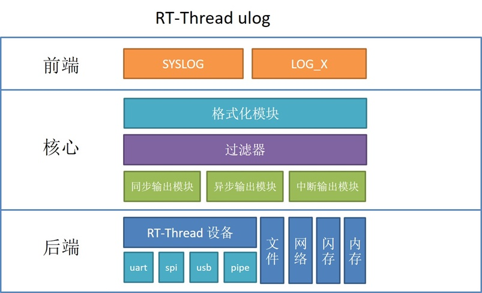

# 系统日志

> 注意：本节说的`日志`是系统**系统日志**，不是**飞行数据记录**（该功能在logger模块中实现），通俗的讲，就是`printf()`输出到终端的文本日志！！！！NextPilot基于了RT-Thread的[ulog组件](https://www.rt-thread.org/document/site/#/rt-thread-version/rt-thread-standard/programming-manual/ulog/ulog)来实现系统日志的管理。

**日志的定义**：日志是将软件运行的状态、过程等信息，输出到不同的介质中（例如：文件、控制台、显示屏等），并进行显示和保存。为软件调试、维护过程中的问题追溯、性能分析、系统监控、故障预警等功能，提供参考依据。可以说，日志的使用，几乎占用的软件生命周期的至少 80% 的时间。

**日志的重要性**：对于操作系统而言，由于其软件的复杂度非常大，单步调试在一些场景下并不适合，所以日志组件在操作系统上几乎都是标配。完善的日志系统也能让操作系统的调试事半功倍。

## 系统日志层次

|函数|中断输出|异步输出|终端显示|系统日志|飞控日志|地面站显示|
|---|---|---|---|---|---|---|
|rt_kprintf|√|×|√|×|×|×|
|LOG_E/I/W/D/RAW|√|√|√|√|√|×|
|mavlink_log_xxx|√|√|√|√|√|√|

### rt_kprintf


`rt_kprintf()`是标准库函数`printf()`的简化版本。只是在Finsh控制台输出，一般是打印Finsh终端的交互指令，用于嵌入式调试。

如果不是特殊需求，建议使用 rt_kprintf 函数，因为 printf 是由编译平台内部提供的，其空间占用、以及内存使用情况我们无从得知，printf 函数要比 rt_kprintf 函数的 ROM 占用大很多。

无论是 rt_kprintf 函数以及 printf 函数都是非线程函数，在多线程同时使用的情况下，会出现交叉打印的现象，该问题是正常现象，因为根据 C 标准的要求，printf 函数就是非线程安全的。

原生 rt_kprintf 函数是经过优化的，占用空间要比 printf 函数小很多。但是 rt_kprintf 函数并不支持浮点类型的输出。因此：

- 如需 rt_kprintf 函数支持浮点类型的输出，可以安装 [rt_vsnprintf_full](https://github.com/mysterywolf/rt_vsnprintf_full) 软件包。
- 如需 rt_kprintf 函数支持线程安全输出，可以安装 [rt_kprintf_threadsafe](https://github.com/mysterywolf/rt_kprintf_threadsafe) 软件包。
- 上述两个软件包可以同时安装使用，以同时让 rt_kprintf 支持线程安全和浮点类型输出的能力。

### LOG_xxx

LOG_I/D/W/E()，是RT-Thread ULOG官方提供的组件。Nextpilot通过添加ULOG的后端功能，使得LOG_XXX宏具备在终端输出（console backend），保存到系统日志文件（file backend），保存到飞控日志文件（uorb backend）。支持异步输出（不占用主线程资源），支持标签、时间戳、彩色等。一般记录程序运行的事件、提示、警告、错误等，由于记录到了文件中，因此可以用来辅助飞行事故分析，了解系统的运行过程。


```c
// 在需要使用LOG_XXX宏的C/C++文件最顶上添加
#define LOG_TAG "mytag"  # 这个是标签，用来区分是日志来自哪个文件
#define LOG_LVL LOG_LVL_INFO # 这个是日志输出级别，低于这个级别不打印

// 添加头文件，LOG_TAG和LOG_LVL一定要在这个之上定义
#include <rtdbg.h>

// do something
LOG_I("this is LOG_I"); // LOG_XXX会自动添加换行
```

### mavlink_log_xxx

mavlink_log_xxx()，是对LOG_XXX的封装，并转为mavlink消息下发给地面站，因此具备在终端输出、保存到系统日志文件和飞控日志文件、并通过mavlink发送到地面站。一般是特别重要的信息，在飞行过程中，可以直接语音提醒用户。


## ULOG组件介绍

ulog 是一个非常简洁、易用的 C/C++ 日志组件，第一个字母 u 代表 μ，即微型的意思。它能做到最低**ROM<1K, RAM<0.2K**的资源占用。ulog 不仅有小巧体积，同样也有非常全面的功能，其设计理念参考的是另外一款 C/C++ 开源日志库：EasyLogger（简称 elog），并在功能和性能等方面做了非常多的改进。主要特性如下：

* 日志输出的后端多样化，可支持例如：串口、网络，文件、闪存等后端形式。

* 日志输出被设计为线程安全的方式，并支持异步输出模式。

* 日志系统高可靠，在中断 ISR 、Hardfault 等复杂环境下依旧可用。

* 日志支持运行期 / 编译期设置输出级别。

* 日志内容支持按关键词及标签方式进行全局过滤。

* API 和日志格式可兼容 linux syslog。

* 支持以 hex 格式 dump 调试数据到日志中。

* 兼容 rtdbg （RTT 早期的日志头文件）及 EasyLogger 的日志输出 API。

下图为 ulog 日志组件架构图：



* **前端**：该层作为离应用最近的一层，给用户提供了 syslog 及 LOG_X 两类 API 接口，方便用户在不同的场景中使用。

* **核心**：中间核心层的主要工作是将上层传递过来的日志，按照不同的配置要求进行格式化与过滤然后生成日志帧，最终通过不同的输出模块，输出到最底层的后端设备上。

* **后端**：接收到核心层发来的日志帧后，将日志输出到已经注册的日志后端设备上，例如：文件、控制台、日志服务器等等。

### 日志级别

日志级别代表了日志的重要性，在 ulog 中由高到低，有如下几个日志级别：

| **级别**        | **名称** | **描述**           |
| ------------ | ---- | ----------------------- |
| LOG_LVL_ASSERT  | 断言 | 发生无法处理、致命性的的错误，以至于系统无法继续运行的断言日志 |
| LOG_LVL_ERROR   | 错误 | 发生严重的、**不可修复**的错误时输出的日志属于错误级别日志  |
| LOG_LVL_WARNING | 警告 | 出现一些不太重要的、具有**可修复性**的错误时，会输出这些警告日志 |
| LOG_LVL_INFO    | 信息 | 给本模块上层使用人员查看的重要提示信息日志，例如：初始化成功，当前工作状态等。该级别日志一般在量产时依旧**保留**|
| LOG_LVL_DBG     | 调试 | 给本模块开发人员查看的调试日志，该级别日志一般在量产时**关闭**|

在 ulog 中日志级别还有如下分类：

* **静态级别与动态级别**：按照日志是否可以在运行阶段修改进行分类。可在运行阶段修改的称之为动态级别，只能在**编译阶段**修改的称之为静态级别。比静态级别低的日志（这里特指使用 LOG_X API 的日志）将不会被编译到 ROM 中，最终也不会输出、显示出来。而动态级别可以管控的是高于或等于静态级别的日志。在 ulog 运行时，比动态级别低的日志会被过滤掉。

* **全局级别与模块级别**：按照作用域进行的分类。在 ulog 中每个文件（模块）也可以设定独立的日志级别。全局级别作用域大于模块级别，也就是模块级别只能管控那些高于或等于全局级别的模块日志。

综合上面分类可以看出，在 ulog 可以通过以下 4 个方面来设定日志的输出级别：

* **全局静态**日志级别：在 menuconfig 中配置，对应 `ULOG_OUTPUT_LVL` 宏。

* **全局动态**日志级别：使用 `void ulog_global_filter_lvl_set(rt_uint32_t level)` 函数来设定。

* **模块静态**日志级别：在模块（文件）内定义 `LOG_LVL` 宏，与日志标签宏 `LOG_TAG` 定义方式类似。

* **模块动态**日志级别：使用 `int ulog_tag_lvl_filter_set(const char *tag, rt_uint32_t level)` 函数来设定。

它们的作用范围关系为：**全局静态**>**全局动态**>**模块静态**>**模块动态**。

### 日志标签

由于日志输出量的不断增大，为了避免日志被杂乱无章的输出出来，就需要使用标签（tag）给每条日志进行分类。标签的定义是按照**模块化**的方式，例如：Wi-Fi 组件包括设备驱动（wifi_driver）、设备管理（wifi_mgnt）等模块，则 Wi-Fi 组件内部模块可以使用 `wifi.driver`、`wifi.mgnt` 等作为标签，进行日志的分类输出。

每条日志的标签属性也可以被输出并显示出来，同时 ulog 还可以设置每个标签（模块）对应日志的输出级别，当前不重要模块的日志可以选择性关闭，不仅降低 ROM 资源，还能帮助开发者过滤无关日志。

参见 `rt-thread\examples\ulog_example.c` ulog 例程文件，在文件顶部有定义 `LOG_TAG` 宏：

```c
#define LOG_TAG     "example"     // 该模块对应的标签。不定义时，默认：NO_TAG
#define LOG_LVL     LOG_LVL_DBG   // 该模块对应的日志输出级别。不定义时，默认：调试级别
#include <ulog.h>                 // 必须在 LOG_TAG 与 LOG_LVL 下面
```

需要注意的，定义日志标签必须位于 `#include <ulog.h>` 的上方，否则会使用默认的 `NO_TAG`（不推荐定义在头文件中定义这些宏）。

日志标签的作用域是当前源码文件，项目源代码通常也会按照模块进行文件分类。所以在定义标签时，可以指定模块名、子模块名作为标签名称，这样不仅在日志输出显示时清晰直观，也能方便后续按标签方式动态调整级别或过滤。

### 输出 API

ulog 主要有两种日志输出宏 API，源代码中定义如下所示：

```c
#define LOG_E(...)                           ulog_e(LOG_TAG, __VA_ARGS__)
#define LOG_W(...)                           ulog_w(LOG_TAG, __VA_ARGS__)
#define LOG_I(...)                           ulog_i(LOG_TAG, __VA_ARGS__)
#define LOG_D(...)                           ulog_d(LOG_TAG, __VA_ARGS__)
#define LOG_RAW(...)                         ulog_raw(__VA_ARGS__)
#define LOG_HEX(name, width, buf, size)      ulog_hex(name, width, buf, size)
```

* 宏 `LOG_X(...)`：`X` 对应的是不同级别的第一个字母大写。参数 `...` 为日志内容，格式与 printf 一致。这种方式是首选，一方面因为其 API 格式简单，入参只有一个即日志信息，再者还支持按模块静态日志级别过滤。

* 宏 `ulog_x(LOG_TAG, __VA_ARGS__)`：`x` 对应的是不同级别的简写。参数 `LOG_TAG` 为日志标签，参数 `...` 为日志内容，格式与 printf 一致。这个 API 适用于在一个文件中使用不同 tag 输出日志的情况。

|  **API**  |**描述**                                |
|-------------------------|--------------------------|
| LOG_E(...)| 错误级别日志                         |
| LOG_W(...) | 错误级别日志    |
| LOG_I(...) | 提示级别日志   |
| LOG_D(...)| 调试级别日志                |
| LOG_RAW(...) | 输出 raw 日志   |
| LOG_HEX(name, width, buf, size)| 输出 16 进制格式数据到日志    |

`LOG_X` 及 `ulog_x` 这类 API 输出都是带格式日志，有些时候需要输出不带任何格式的日志时，可以使用 `LOG_RAW`  或 `ulog_raw()` 。例如：

```c
LOG_RAW("\r");
ulog_raw("\033[2A");
```

以 16 进制 hex 格式 dump 数据到日志中可使用可以使用 `LOG_HEX()`  或 `ulog_hex` 。函数参数及描述如下所示：

| **参数**  | **描述**                        |
| ---- | -------------------------- |
| tag   | 日志标签                    |
| width | 一行 hex 内容的宽度（数量） |
| buf   | 待输出的数据内容            |
| size  | 数据大小                    |

hexdump 日志为 DEBUG 级别，支持运行期的级别过滤，hexdump 日志对应的 tag ，支持运行期的标签过滤。

ulog 也提供里断言 API ：`ASSERT(表达式)` ，当断言触发时，系统会停止运行，内部也会执行 `ulog_flush()` ，所有日志后端将执行 flush 。如果开启了异步模式，缓冲区中所有的日志也将被 flush 。断言的使用示例如下：

```
void show_string(const char *str)
{
    ASSERT(str);
    ...
}
```