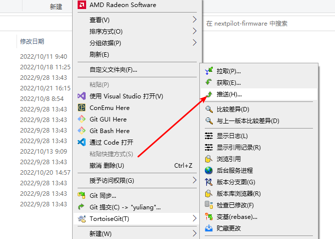

# 贡献代码

## 代码风格
[Visual Stuio Code](https://azure.microsoft.com/zh-cn/products/visual-studio-code/) 默认安装 clang ，另外在工程目录下 `.clang-format` 文件指定了代码格式化风格。在以下操作的时候会自动格式化代码：
- 保存的时候
- 粘贴的时候

## 提交规范

当我们使用Git提交代码时，都需要写 [Commit Message] 提交说明才能够正常提交。然而，我们平时在编写提交说明时，通常会直接填写如"fix"或"bug"等不规范的说明，不规范的提交说明很难让人明白这次代码提交究竟是为了什么。而在工作中，一份清晰简介规范的 Commit Message 能让后续代码审查、信息查找、版本回退都更加高效可靠。因此我们需要一些工具来约束开发者编写符合规范的提交说明。

提交需要包括修改类型和内容，通常由三个部分组合：type（必填）、scope（可选）、subject（必填）

### 辅助插件

首先，在vscode商店中搜索插件： `git-commit-plugin`，点击安装：


在安装完插件后，在vscode侧边栏可见如下：


在git小图标唤醒插件界面：


选择这次更改的类型 如：🐞fix是修复 bug 然后选择 **Complete** 即完成本次修改（按下键盘上的 **Esc** 键则离开输入）

### 参数详解

**type(必须)**

用于说明提交的类别，只允许使用下面的标识：

🎉init：项目初始化

✨feat：增加新功能

🐞fix：修复bug，适合于一次提交直接修复问题

📃docs：文档的添加或修改

🌈style：格式的变动（不影响代码运行）

🦄refactor：重构（即不是新增功能，也不是修改bug的代码变动）

🎈perf：优化相关，比如提升性能、体验

🧪test：增加测试

🔧build：构建过程或辅助工具的变动

**scope(可选)**

scope 用于说明本次提交的影响范围，比如数据层、控制层、视图层等等，视项目不同而不同。

**subject(必须)**

subject是commit目的的简短描述，不超过50个字符。

建议使用中文。结尾不加句号或其他标点符号。完成输入后选择**Complete**，再推送到远端：


**Body(可选)**

Body 部分是对本次 commit 的详细描述，可以分成多行。

**Footer(可选)**

如果当前的 commit 针对某个 issue，那么可以在 Footer 关闭这个 issue。

## 分支管理

在日常开发中，需要经常提交自己的开发代码（无需完成一个模块才提交），特别是在下班前；当需要将自己的分支代码合并到主分支（main）时，需要做变基处理。

### 获取远端信息

首先，需要将远端的分支信息拉取到本地，方法如下：
```
git fetch
```


### 进行变基操作

将本地分支变基到远端的最新main分支，在变基过程中如果有冲突，需要手动解决：
```
git rebase origin/main
```


### 删除远端分支

由于变基后，本地的开发者分支的时间节点落后于远端分支的时间节点，现在推送本地分支到远端会失败，因此在推送分支前需要删除远端分支。方法如下：
```
git push origin --delete <你的分支名称>
```


### 同步到远端

变基并删除远端分支之后，就可以将本地分支推动到远端了：
```
git push
```
