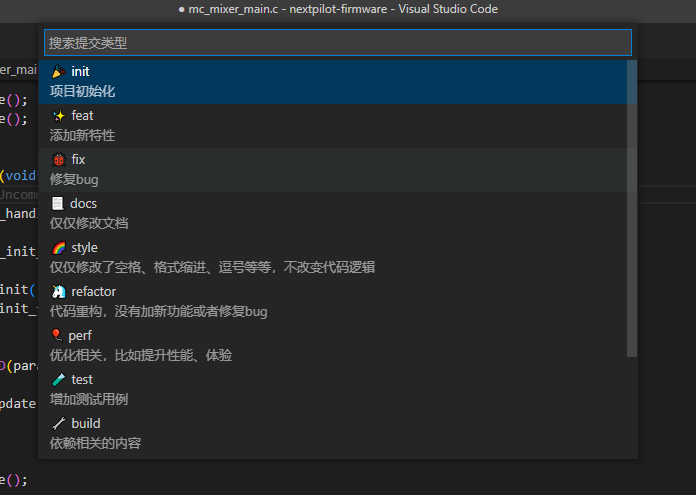
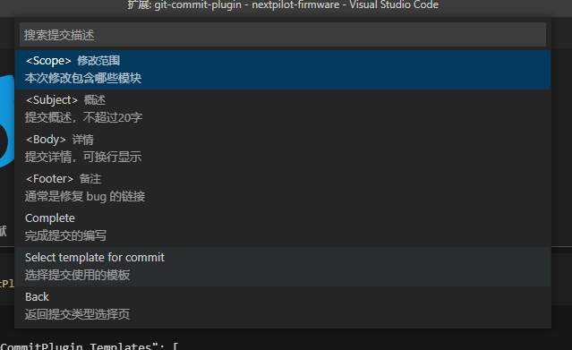

# 贡献代码

本章节需要您具备 git 和 github 的基本知识，会使用 git 版本管理工具，以及熟悉 github 的协作开发流程。

## 分支模型


NextPilot 依托 Github Flow 进行项目迭代，它只有一个长期分支，就是 master，因此用起来非常简单。

第一步：根据需求，从master拉出新分支，不区分功能分支或补丁分支。

第二步：新分支开发完成后，或者需要讨论的时候，就向master发起一个pull request（简称PR）。

第三步：Pull Request既是一个通知，让别人注意到你的请求，又是一种对话机制，大家一起评审和讨论你的代码。对话过程中，你还可以不断提交代码。

第四步：你的Pull Request被接受，合并进master，重新部署后，原来你拉出来的那个分支就被删除。

## 代码风格

`nextpilot-flight-control.code-workspace` 是 Vscode 工作空间文件，已经配置好以下格式化工具，在 **保存** 文件时会自动触发自动格式化：

- 使用 `clang-format` 对 C/C++ 代码格式化
- 使用 `black` 对 python 代码格式化
- 使用 `DavidAnson.vscode-markdownlint` 对 markdown 格式化
- 使用 `tamasfe.even-better-toml` 对 toml 格式化
- 使用 `redhat.vscode-yaml` 对 yaml 格式化

### C/C++

NextPilot 使用 [ClangFormat](https://clang.llvm.org/docs/ClangFormat.html) 对 C/C++ 代码进行格式化，仓库根目录的 [.clang-format](../.clang-format) 文件定义了格式化的全局配置，相关意义[请参考这里](https://clang.llvm.org/docs/ClangFormatStyleOptions.html)。

如果您 **不希望** 对某个文件下的代码进行格式化，请在该文件夹下添加一个`.clang-format`文件，内容如下：

```yml
# Available style options are described in https://clang.llvm.org/docs/ClangFormatStyleOptions.html
#
# An easy way to create the .clang-format file is:
#
# clang-format -style=llvm -dump-config > .clang-format
#
---
Language: Cpp
DisableFormat: true
---
```

核心语句就是 `DisableFormat: true`，表示禁用 clang-format 格式化。

### Python

使用 black 进行自动格式化。

## 提交规范

当我们使用Git提交代码时，都需要填写 `Commit Message` 提交说明。一份清晰简介规范的 `Commit Message` 能让后续代码审查、信息查找、版本回退都更加高效可靠，因此有必要约束开发者编写符合规范的提交说明。

NextPilot 提交信息规范，遵循[Angular Team Commit Specification,](https://github.com/angular/angular.js/blob/master/DEVELOPERS.md#-git-commit-guidelines)，主要包含以下内容：

- type（必填），提交的类别，比如feat，fix等
- scope（可选），提交的影响范围
- subject（必填），提交的主题，一般50字内
- body（可选），提交内容详细说明
- footer（可选），提交针对某个 issue 或者 task 的链接
- sign off（必须），所谓Sign-Off就是在`commit message`尾部增加一个作者的信息

```
<type>(<scope>): <subject>

<body> 提交内容详细说明

<footer> 对应issue或task的链接

<sign-off> 签名
```

以下是一个标准的 Commit Message：

```
Commit: 37515b80fa150e1ef315824e63098231d4af4031
Parents: eb15ff286ba204ebf1eb6b79915a8a9b806cf869
Author: latercomer <latercomer@qq.com>
Committer: latercomer <latercomer@qq.com>
Date: Thu Sep 26 2024 15:42:49 GMT+0800 (中国标准时间)

✨feat(mc_att_control): add hover thrust throttle estimator

add hover thrust throttle estimator to mc_att_control, set param MC_HOVER_THROTTL_METHOD select estimator method

https://github.com/nextpilot/nextpilot-flight-control/issues/110

Signed-off-by: latercomer <latercomer@qq.com>
```

### 设置Sign-Off

使用命令行`git commit`提交修改时，`-s`选项，可以`commit message`尾部自动添加`Sign-Off`信息：

```shell
git commit -m "your commit message" -s
```

VS Code 使用快捷键 `ctr + ,`打开设置页面，搜索`sign off`，然后勾选`Allways Sign Off`


### 辅助插件

在vscode商店中搜索插件 `git-commit-plugin`，点击安装：


安装完插件后，在vscode侧边栏`源代码管理`页面，点击下图所示图标，启动插件


选择这次更改的类型 如：🐞fix是修复 bug 然后选择 **Complete** 即完成本次修改（按下键盘上的 **Esc** 键则离开输入）

#### type(必须)

提交类别，允许使用下面的标识：

- 🎉init：项目初始化
- ✨feat：增加新功能
- 🐞fix：修复bug，适合于一次提交直接修复问题
- 📃docs：文档的添加或修改
- 🌈style：格式的变动（不影响代码运行）
- 🦄refactor：重构（即不是新增功能，也不是修改bug的代码变动）
- 🎈perf：优化相关，比如提升性能、体验
- 🧪test：增加测试
- 🔧build：构建过程或辅助工具的变动



#### scope(可选)

scope 用于说明本次提交的影响范围，比如数据层、控制层、视图层等等，视项目不同而不同。

#### subject(必须)

subject是commit的简短描述，不超过50个字符。完成输入后选择**Complete**，再推送到远端：



#### Body(可选)

Body 部分是对本次 commit 的详细描述，可以分成多行。

#### Footer(可选)

如果当前的 commit 针对某个 issue，那么可以在 Footer 关闭这个 issue。

## 贡献代码

首先您必须有一个 [github](https://github.com) 账号，才能 [nextpilot-flight-control](https://github.com/nextpilot/nextpilot-flight-control) 项目的开发。
