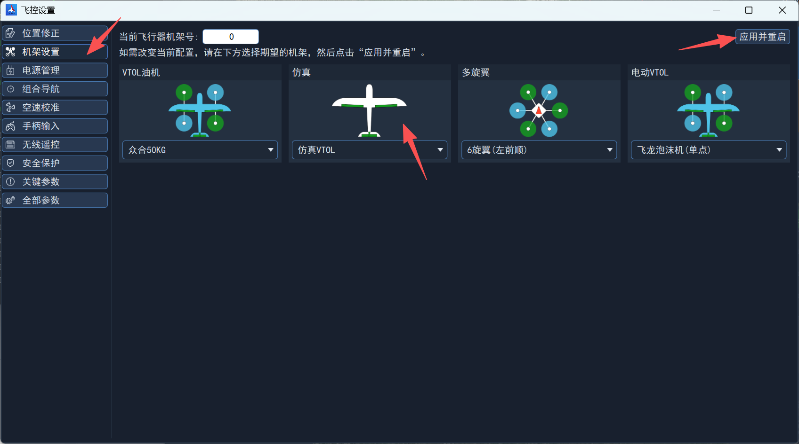

# 软件在环仿真（SITL）

## 简介

软件在环仿真是指在计算机创建一个软件仿真环境，通过创建一个六自由度模型仿真真实飞机，所有的传感器都是虚拟的。

> 注意：软件在环仿真只支持UDP通信连接。

## 仿真环境配置

- 操作系统：Windows；
- 软件：Qemu，地面站。

### 安装Qemu

1. 下载[QEMU for Windows – Installers (64 bit)](https://qemu.weilnetz.de/w64/)，推荐7.1.0；
2. 双击安装程序，默认安装在C盘即可；

3. 安装完毕后，将qemu安装目录`C:\Program Files\qemu`添加至环境变量。

### 下载仿真固件

1. 在[飞控固件发布](../../download/index.md)下载编译好的仿真固件（sitl-qemu.bin）、启动脚本（qemu.bat）、日志提取脚本（extract_sd.bat）；
2. 创建一个文件夹，例如`nextpilot_sitl`，然后将固件和仿真脚本拷贝至该目录：


## 启动飞控仿真

双击qemu.bat，自动弹出qemu终端窗口，部分启动信息打印如下：

```bash
=================================================================
         _   __             __   ____   _  __        __
        / | / /___   _  __ / /_ / __ \ (_)/ /____   / /_
       /  |/ // _ \ | |/_// __// /_/ // // // __ \ / __/
      / /|  //  __/_>  < / /_ / ____// // // /_/ // /_
     /_/ |_/ \___//_/|_| \__//_/    /_//_/ \____/ \__/

 Copyright All Reserved (C) 2015-2026 CetcsPilot Development Team
=================================================================
HW ARCH: SITL-QEMU-A9(ver 0, rev 0)
MCU  IDC: ARM Cortex-A9(devid 0, revid 0)
MCU  UID: 000
FW  TAG: v0.9.6-4-gfa9a96911-dirty
FW HASH: fa9a969112548193815556f9f2f5b482b2cc4b35(main)
OS  VER: RT-Thread V4.1.1
OS HASH: aab2428d4177a02cd3b0fd020e47a88de379a6ab(lts-v4.1x)
Toolchain: GNU GCC 10.3.1 20210824 (release)
Build  URI: alex@2.0.0.1(alex-xiaomi)
Build TIME: Jul  3 2024 16:00:04
--------------------------------------------------------------
[39] I/sal.skt: Socket Abstraction Layer initialize success.
[66] I/SDIO: SD card capacity 262144 KB.
rt_hw_us_delay() doesn't support for this board.Please consider implementing rt_hw_us_delay() in another file.
rt_hw_us_delay() doesn't support for this board.Please consider implementing rt_hw_us_delay() in another file.
rt_hw_us_delay() doesn't support for this board.Please consider implementing rt_hw_us_delay() in another file.
msh />[1040] I/SDMNT: mount sd0 done!
[1051] I/param: start ok
[1051] I/airframe: init ok
[1056] I/dataman: start ok
[1056] I/logger_task: init ok
```

## 连接地面站

启动地面站软件，在左侧侧栏，点击常规区域内`设备连接`，打开设备连接界面，在最下方设置UDP端口号为14550，然后勾选`自动连接UDP`，即可动创建与仿真飞控的通信连接。


## 设置机架

在地面站软件中，打开`飞控设置`界面，进入`机架设置`。

> 注意：
>
> **如果地面站正常连接仿真飞控后，在飞控设置界面无法显示机架设置，请在地面站主界面，点击右上角并选择`更新参数`！**

点击仿真VTOL，最后点击`应用并重启`。



关闭qemu仿真终端，重新启动飞控仿真即可。

## 飞行仿真

参考[地面站使用手册](../01-快速入门/04-连接地面站.md)进行无人机飞行控制。

## 获取日志

首次启动仿真会在当前仿真文件目录下自动创建sd.bin，用于存放日志、参数、航线，飞行完成后，双击`extract_sd.bat`脚本后会将这些文件提取并存放至`sd`文件夹中。
