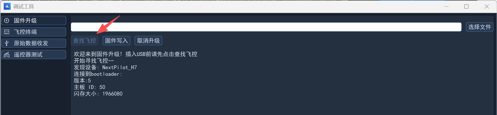
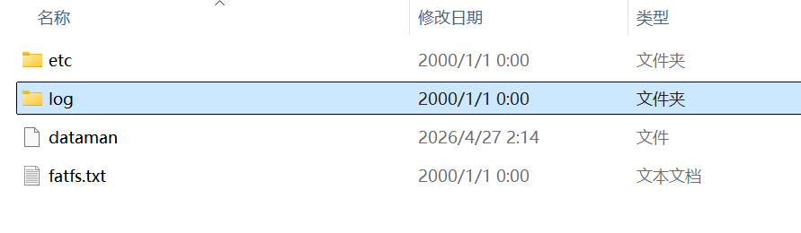

# 下载日志

## 简介

无人机飞行日志保存在SD卡中，默认上电后立即记录日志。同一天的日志放到以日期命名的文件夹中，例如`2026-06-06`，每个日志文件名格式为`YYYYmmDD_hhmmss.ulg`。若飞控内部RTC日期失效，则创建`sessXXX`文件夹存放日志，其中XXX为序号，依次增大。

飞控嵌入式系统使用模拟U盘的方式将SD挂载到计算机，这样可以直接从中拷贝日志。

## 下载

### 打开调试工具界面

点击地面站左侧侧栏，点击`调试工具`，然后选择`固件升级`。

### 挂载SD卡

> 挂载SD卡的流程与固件升级比较相似，但是不需要选择文件与烧写固件。

在固件升级界面，点击`查找飞控`，然后使用Type-C USB线再连接飞控**FCS-USB**口至计算机，地面站会立即识别并显示相关信息，如下图所示：

### 拷贝日志

点开文件资源管理器，然后打开U盘即可看到日志文件目录。如下图所示：

打开log文件夹拷贝对应的日志即可。