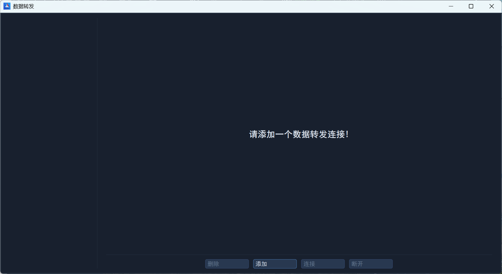
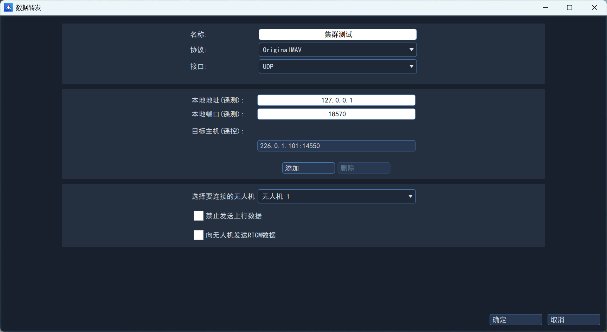
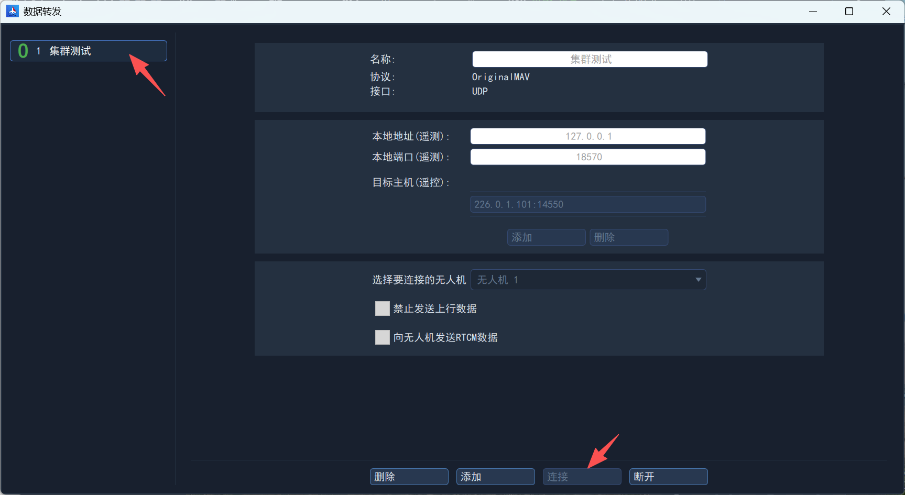

# 数据转发

## 简介

数据转发是指地面站可将无人机数据转发至一个远程主机，实现“数据分享”，这时地面站将是一个“中转站”，用于无人机与远程主机之间进行通信转发！

目前根据业务需求实现了如下几个场景的数据转发：

1. 仿真时进行数据转发；

2. 对原始数据进行透传转发；
3. 外场飞行时将数据转发至塔台、指控中心等（需要根据协议进行开发）。

## 创建转发连接

### 打开数据转发界面

在地面站左侧侧栏工具区域内，点击`数据转发`，打开数据转发界面。如下图所示：

### 添加连接

点击添加，即可创建新数据转发连接，主要需要的设置内容包括：

名称：根据业务填写；

协议：OriginalMAV（原始协议，与无人机通信协议一致）；

接口：可选择串口或UDP接口，如果是串口则需要选择串口号、设置波特率，如果是UDP，则选择对应的目标地址和目标端口号；

要连接的无人机：从下拉列表中选择正在与地面站通信的无人机。

### 开始连接

在左侧选择连接对象，点击下方连接按钮即可。

## 其他设置

### 禁止发送上行数据

如果不希望远程主机对无人机进行控制，则可以勾选`禁止发送上行数据`，这样地面站会自动屏蔽远程主机上行遥控数据。
