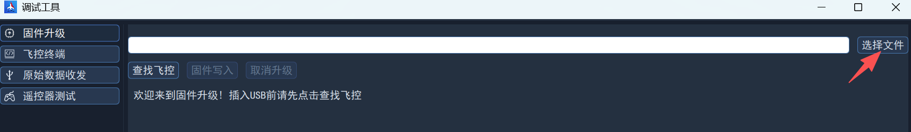
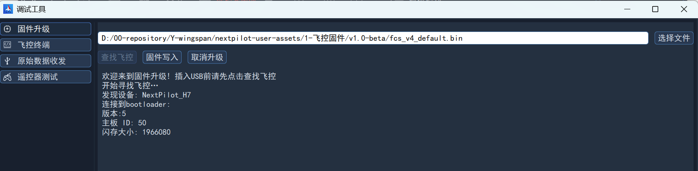
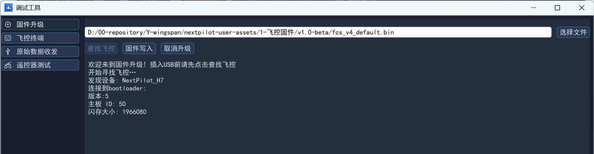
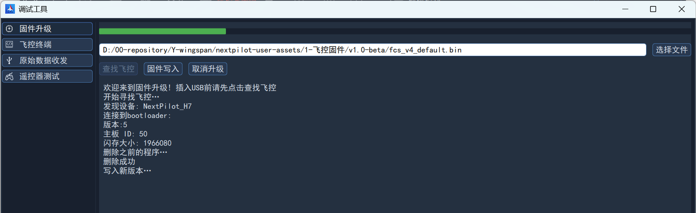
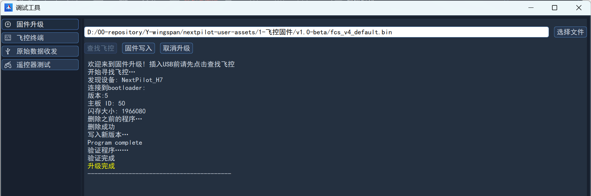

# 烧录固件

> 由于导航飞控内置了两个主控芯片，一个用于运行飞控程序，一个用于运行导航程序。通过FCS-USB烧录飞控固件，通过AHRS-USB烧录导航固件。出厂默认烧录最新的固件，由于飞控程序会频繁更新，两个固件版本对应关系请在[资源下载](../../download/index.md)中详细了解。

## 准备

准备如下内容：

1. 飞控固件，在[资源下载](../../download/index.md)中下载相应版本；
2. 导航飞控，请在[产品中心](../../product/index.md)查看；
3. 调试板硬件（如果没有调试板或飞控以及装机，则需要自行根据飞控接口线序表完成USB下载接口的连接）；
4. Type-C USB线。

## 烧写飞控固件

### 选择文件

打开地面站，在左侧侧栏内的工具区域，点击`调试工具`并选择`固件升级`，在固件升级界面，点击“选择文件”按钮，在对话框中选择目标固件即可，如下图所示：

选择目标固件并退出对话框后，文本框中显示固件路径。

### 连接飞控

点击查找飞控，如下图所示：

然后使用Type-C USB线再连接飞控**FCS-USB**口至计算机，地面站会立即识别并显示相关信息，如下图所示：

### 固件写入

然后点击固件写入即可开始固件擦除、固件烧写流程，如下图所示：

完成烧写后提示如下图：

## 烧写导航固件

导航固件的烧写流程与飞控固件烧写流程一致，不同的地方在于：

- 选择文件时，一定要选择导航固件，导航固件名一般以`ins_`开头；
- 要选择AHRS-USB连接至计算机。
