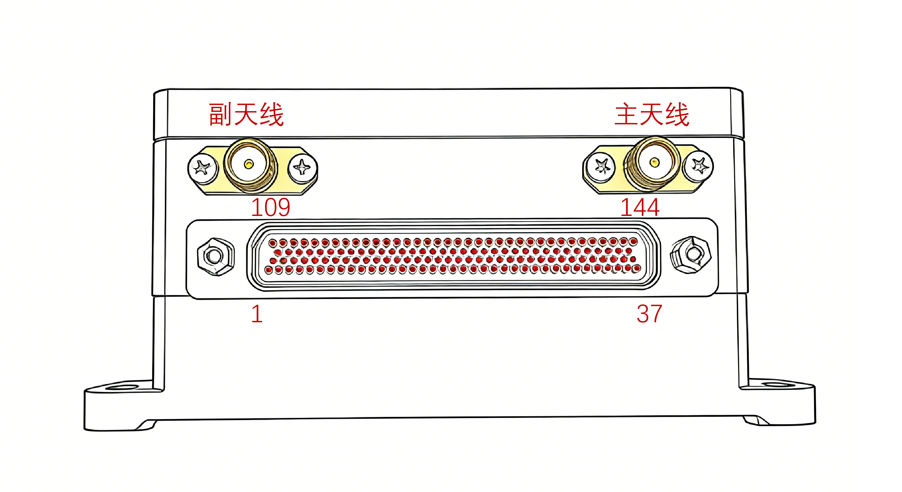
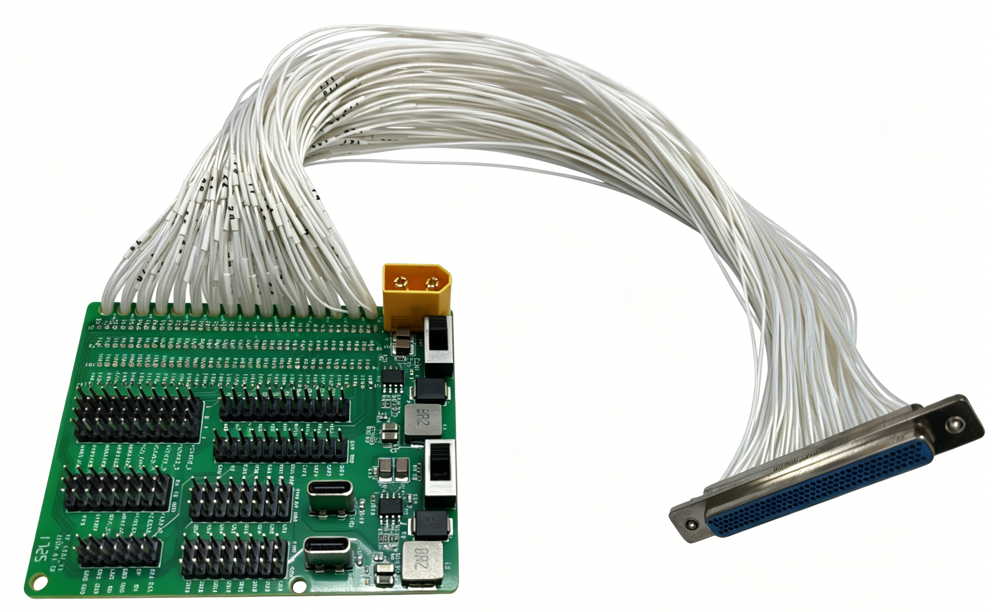

# NP-FCC-H05

## 简介

​  NP-FCC-H05是NextPilot团队研发的高性能、工业级、一体化导航飞控产品，搭载了高性能、双冗余度、内置减震的惯性测量单元（IMU），具备可靠性高、稳定性好、抗震动能力强的特点；采用了自研导航算法和失控保护策略，定位精度高、抗干扰能力强；集成了强大功能，包括动平台起降、视觉导航、集群编队飞行等，并提供外部飞行控制接口，支持二次开发，满足各类场景的应用开发需求。该产品适用于10kg~300kg级各种类型的无人机平台，包括多旋翼、固定翼、垂起、倾转等机型等，搭配专业地面站，提供强大的飞行功能和安全的飞行保障。

## 产品特色

- 内置高性能IMU，无需减震安装

## 功能性能

### 主要功能

目前导航飞控主要功能有：

1. 支持多种机型，包括多旋翼、固定翼、垂起（VTOL）；
2. 具备手动、定高、定点、特技、悬停、任务航线、外部控制、自主起降、返航等多种飞行模式；
3. 具备数据链丢失保护、卫星信号丢失保护、发动机失效保护、低电压告警及保护等各类应急保护逻辑；
4. 具备异地起降功能；
5. 具备电子围栏功能；
6. 具备硬件在环仿真及软件仿真功能；
7. 具备多机控制能力；
8. 支持多级编队；
9. 广泛支持各类卫星导航板卡，包括Novatel（OEM718D）、和芯星通（UM482、UM982）等板卡；
10. 搭载高精度工业级IMU，无需外部减震；
11. 具备软件串口升级功能；
12. 具备日志记录回放能力（PX4日志格式）；
13. 具备软件版本查询功能。

### 主要性能

​  导航飞控性能指标说明如下：

1. 尺寸：≤112mm×72mm×42mm（长×宽×高）；
2. 重量：400g；
3. 供电电压：直流9~36V；
4. 功耗：＜12W；
5. 启动时间：不大于40s；
6. 高度控制精度：＜1m；
7. 串口数量：8路；
8. PWM数量：16路
9. DO：4路；
10. ADC采集：4路；

11. 陀螺仪：测量范围±400°/s、陀螺仪零偏20°/h（1σ）；
12. 加速度计：测量范围±10g、加速度计零偏1mg；
13. 工作温度：-40℃~75℃；
14. 贮存温度：-45℃~80℃；
15. 高低温工作、振动、冲击、电磁兼容符合GJB要求。

## 电气接口 {#电气接口}

​  飞控提供了两个SMA接头用于双天线连接，其中右侧为主天线接头，左侧为辅天线接头；提供了航空连接器，型号为J30J-144ZKW-J，接口布局如下图所示。

## 安装尺寸

安装孔直径4mm，间距107mm*87mm。

## 接口定义

飞控连接器型号为J30J-144ZKW-J，引脚定义如下：

| 序号 | 引脚 | 定义            | 功能说明                       | 外部设备                          |
| ---- | ---- | --------------- | ------------------------------ | --------------------------------- |
| 1    | 2    | Power-VCC       | 供电输入正（DC9~36V）          |                                   |
| 2    | 3    | Power-VCC       |                                |                                   |
| 3    | 4    | Power-VCC       |                                |                                   |
| 4    | 38   | Power-GND       | 供电输入负（DC9~36V）          |                                   |
| 5    | 39   | Power-GND       |                                |                                   |
| 6    | 40   | Power-GND       |                                |                                   |
| 7    | 1    | EARTH           | 接外壳地                       |                                   |
| 8    | 74   | BATT1_VOL       | 电压采集                       | 动力电池VCC引脚                   |
| 9    | 75   | BATT1_CUR       | 电流采集                       |                                   |
| 10   | 76   | BATT1_GND       | ADC1地                         |                                   |
| 11   | 109  | ADC1_SPARE_1    | ADC采集                        |                                   |
| 12   | 110  | ADC1_SPARE_2    | ADC采集                        |                                   |
| 13   | 111  | ADC_GND         | ADC2地                         |                                   |
| 14   | 5    | FCS_DO1         | 飞控板-DO1                     | 启发一体，发动机启动开关引脚      |
| 15   | 6    | FCS_DO2         | 飞控板-DO2                     | 启发一体，发电控制开关引脚        |
| 16   | 7    | FCS_DO3         | 飞控板-DO3                     | 启发一体，油泵开关引脚            |
| 17   | 8    | FCS_DO4         | 飞控板-DO4                     | 载荷电源控制开关引脚              |
| 18   | 14   | DO_GND          | GND2                           |                                   |
| 19   | 41   | FCS_ETH_RXN     | 飞控板网络接口（暂时不用）     | 机载网络设备                      |
| 20   | 42   | FCS_ETH_RXP     | 飞控板网络接口（暂时不用）     |                                   |
| 21   | 43   | FCS_ETH_TXN     | 飞控板网络接口（暂时不用）     |                                   |
| 22   | 44   | FCS_ETH_TXP     | 飞控板网络接口（暂时不用）     |                                   |
| 23   | 45   | GND2            | GND2                           |                                   |
| 24   | 51   | FCS_CH1         | PWM输出CH1                     | VTOL（右前电机），多旋翼（电机1） |
| 25   | 52   | FCS_CH2         | PWM输出CH2                     | VTOL（左后电机），多旋翼（电机2） |
| 26   | 53   | FCS_CH3         | PWM输出CH3                     | VTOL（左前电机），多旋翼（电机3） |
| 27   | 54   | FCS_CH4         | PWM输出CH4                     | VTOL（右后电机），多旋翼（电机4） |
| 28   | 55   | FCS_CH5         | PWM输出CH5                     | VTOL（前拉电机），多旋翼（电机5） |
| 29   | 56   | FCS_CH6         | PWM输出CH6                     | 多旋翼（电机6）                   |
| 30   | 57   | FCS_CH7         | PWM输出CH7                     |                                   |
| 31   | 58   | FCS_CH8         | PWM输出CH8                     |                                   |
| 32   | 15   | FCS_CH_GND1     | GND2                           |                                   |
| 33   | 16   | FCS_CH_GND2     | GND2                           |                                   |
| 34   | 17   | FCS_CH_GND3     | GND2                           |                                   |
| 35   | 18   | FCS_CH_GND4     | GND2                           |                                   |
| 36   | 87   | FCS_CH9         | PWM输出CH9                     | VTOL（左副翼舵机）                |
| 37   | 88   | FCS_CH10        | PWM输出CH10                    | VTOL（右副翼舵机）                |
| 38   | 89   | FCS_CH11        | PWM输出CH11                    | VTOL（左升降舵机）                |
| 39   | 90   | FCS_CH12        | PWM输出CH12                    | VTOL（右升降舵机）                |
| 40   | 91   | FCS_CH13        | PWM输出CH13                    | VTOL（方向舵机）                  |
| 41   | 92   | FCS_CH14        | PWM输出CH14                    |                                   |
| 42   | 93   | FCS_CH15        | PWM输出CH15                    |                                   |
| 43   | 94   | FCS_CH16        | PWM输出CH16                    | VTOL（发动机油门）                |
| 44   | 19   | FCS_CH_GND5     | GND2                           |                                   |
| 45   | 20   | FCS_CH_GND6     | GND2                           |                                   |
| 46   | 21   | FCS_CH_GND7     | GND2                           |                                   |
| 47   | 22   | FCS_CH_GND8     | GND2                           |                                   |
| 48   | 83   | RC_5V_OUT       | 接收机5V供电                   | FUTABA接收机                      |
| 49   | 85   | RC_SBUS_IN      | SBUS信号输入                   |                                   |
| 50   | 84   | RC_SBUS_OUT     | SBUS信号输出                   |                                   |
| 51   | 82   | RC_GND          | GND2                           |                                   |
| 52   | 47   | SAFETY_5V_OUT   | 5V_ISO                         | 安全开关供电引脚                  |
| 53   | 48   | SAFETY_SW_LED   |                                | 呼吸灯引脚                        |
| 54   | 49   | SAFETY_SWITCH   |                                | 安全开关按键引脚                  |
| 55   | 50   | BUZZER          |                                | 外置蜂鸣器                        |
| 56   | 46   | SAFETY_GND      | GND2                           |                                   |
| 57   | 118  | I2C1_5V_OUT     | 5V_ISO                         |                                   |
| 58   | 119  | FCS_IIC_SDA     |                                |                                   |
| 59   | 120  | FCS_IIC_SCL     |                                |                                   |
| 60   | 86   | FCS_IIC_GND     | GND2                           |                                   |
| 61   | 121  | INS_IIC_SDA    |                                |                                   |
| 62   | 122  | INS_IIC_SCK    |                                |                                   |
| 63   | 95   | INS_IIC_GND    | GND2                           |                                   |
| 64   | 139  | FCS_CAN1_H      | FCS_CAN1                       |                                   |
| 65   | 140  | FCS_CAN1_L      |                                |                                   |
| 66   | 141  | INS_CAN1_H     | INS_CAN1                      |                                   |
| 67   | 142  | INS_CAN1_L     |                                |                                   |
| 68   | 101  | FCS_RS232_RX1   | 飞控板串口5（RS232）           | 发动机                            |
| 69   | 102  | FCS_RS232_TX1   |                                |                                   |
| 70   | 103  | FCS_RS232_GND   |                                |                                   |
| 71   | 66   | FCS_RS232_RX2   | 飞控板串口6（RS232）           | P900数据链/吊舱                   |
| 72   | 67   | FCS_RS232_TX2   |                                |                                   |
| 73   | 68   | FCS_RS232_GND   |                                |                                   |
| 74   | 117  | FCS_RS232_RX3   | 飞控板串口7（RS232）           |                                   |
| 75   | 116  | FCS_RS232_TX3   |                                |                                   |
| 76   | 81   | FCS_RS232_GND   |                                |                                   |
| 77   | 123  | FCS_RS422_A1    | 飞控板串口1（RS422）           | 数据链主链                        |
| 78   | 124  | FCS_RS422_B1    |                                |                                   |
| 79   | 125  | FCS_RS422_Y1    |                                |                                   |
| 80   | 126  | FCS_RS422_Z1    |                                |                                   |
| 81   | 127  | FCS_RS422_A2    | 飞控板串口2（RS422）           | 数据链辅链                        |
| 82   | 128  | FCS_RS422_B2    |                                |                                   |
| 83   | 129  | FCS_RS422_Y2    |                                |                                   |
| 84   | 130  | FCS_RS422_Z2    |                                |                                   |
| 85   | 105  | FCS_CAN2_H      | 飞控板CAN2                     |                                   |
| 86   | 106  | FCS_CAN2_L      |                                |                                   |
| 87   | 104  | FCS_CAN2_GND    |                                |                                   |
| 88   | 70   | INS_RS232_RX1  | 导航板串口7                    |                                   |
| 89   | 71   | INS_RS232_TX1  |                                |                                   |
| 90   | 69   | INS_RS232_GND2 |                                |                                   |
| 91   | 131  | FCS_RS422_A3    | 飞控板串口3（RS422）           |                                   |
| 92   | 132  | FCS_RS422_B3    |                                |                                   |
| 93   | 133  | FCS_RS422_Y3    |                                |                                   |
| 94   | 134  | FCS_RS422_Z3    |                                |                                   |
| 95   | 135  | FCS_RS422_A4    | 飞控板串口4（RS422），调试打印 | 飞控板调试串口，调试笔记本        |
| 96   | 136  | FCS_RS422_B4    |                                |                                   |
| 97   | 137  | FCS_RS422_Y4    |                                |                                   |
| 98   | 138  | FCS_RS422_Z4    |                                |                                   |
| 99   | 112  | FCS_USB_VCC     | 飞控板USB，固件烧写，日志下载  | 调试笔记本                        |
| 100  | 113  | FCS_USB_DP      |                                |                                   |
| 101  | 114  | FCS_USB_DM      |                                |                                   |
| 102  | 115  | FCS_USB_GND     |                                |                                   |
| 103  | 78   | INS_USB_DP     | 导航板USB，固件烧写            | 调试笔记本                        |
| 104  | 77   | INS_VBUS       |                                |                                   |
| 105  | 79   | INS_USB_DM     |                                |                                   |
| 106  | 80   | INS_USB_GND    |                                |                                   |
| 107  | 11   | GPS_RS232_TX    |                                |                                   |
| 108  | 12   | GPS_RS232_RX    | RTCA/RTCM数据输入              | 数据链透传串口                    |
| 109  | 9    | GPS_EVENT       |                                |                                   |
| 110  | 10   | GPS_PPS         |                                |                                   |
| 111  | 13   | GND2            | GND2                           |                                   |
| 112  | 28   | INS_RS422_A1   | 导航板串口1（RS422）           | 空速计                            |
| 113  | 29   | INS_RS422_B1   |                                |                                   |
| 114  | 30   | INS_RS422_Y1   |                                |                                   |
| 115  | 31   | INS_RS422_Z1   |                                |                                   |
| 116  | 32   | INS_RS422_A2   | 导航板串口2（RS422）           | 光纤惯导                          |
| 117  | 33   | INS_RS422_B2   |                                |                                   |
| 118  | 34   | INS_RS422_Y2   |                                |                                   |
| 119  | 35   | INS_RS422_Z2   |                                |                                   |
| 120  | 72   | INS_RS422_A3   | 导航板串口3（RS422）           | 军用卫导/IMU调试                  |
| 121  | 36   | INS_RS422_B3   |                                |                                   |
| 122  | 73   | INS_RS422_Y3   |                                |                                   |
| 123  | 37   | INS_RS422_Z3   |                                |                                   |
| 124  | 143  | INS_RS422_A4   | 导航板串口4（RS422），调试串口 | INS_调试串口                     |
| 125  | 107  | INS_RS422_B4   |                                |                                   |
| 126  | 144  | INS_RS422_Y4   |                                |                                   |
| 127  | 108  | INS_RS422_Z4   |                                |                                   |
| 128  | 27   | FCS_CAP4        |                                |                                   |
| 129  | 26   | FCS_CAP5        |                                |                                   |
| 130  | 25   | FCS_CAP6        |                                |                                   |
| 131  | 24   | FCS_CAP7        |                                |                                   |
| 132  | 23   | CAP_GND         |                                |                                   |
| 133  | 96   | N/A             |                                |                                   |
| 134  | 97   | N/A             |                                |                                   |
| 135  | 98   | N/A             |                                |                                   |
| 136  | 99   | N/A             |                                |                                   |
| 137  | 100  | GND2            |                                |                                   |
| 138  | 59   | GND2            |                                |                                   |
| 139  | 60   | GND2            |                                |                                   |
| 140  | 61   | GND2            |                                |                                   |
| 141  | 62   | GND2            |                                |                                   |
| 142  | 63   | GND2            |                                |                                   |
| 143  | 64   | GND2            |                                |                                   |
| 144  | 65   | GND2            |                                |                                   |

## 相关配件

​ 导航飞控配套调试线缆如下图所示：

