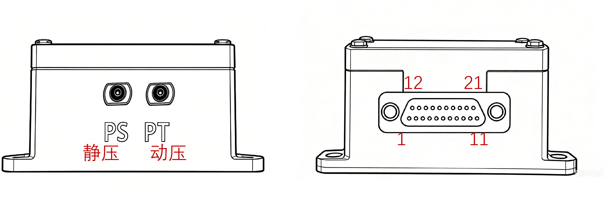

# NP-ADS-H05

## 简介

​  NP-ADS-H05是NextPilot团队研发的工业级大气数据计算机，其内置高性能的集成式数字压力传感器、气压高度传感器、地磁传感器，可测量飞行过程中静压、动压、气压高度，完成高度和速度测量，采用航空连接器，稳定可靠。

## 传感器

- 主控芯片：STM32F107
- 空速传感器：MS5525DSO
- 气压高度传感器：MS5611
- 地磁传感器：RM3100

## 功能性能

### 主要功能

大气数据计算机主要功能有：

1. 具备动压测量功能；
1. 具备温度测量功能；
1. 具备气压测量功能。

### 主要性能

​  大气数据计算机指标说明如下：

1. 尺寸：58mm×44mm×26mm（长×宽×高）；
2. 重量：56g；
3. 供电电压：直流9~36V；
4. 功耗：＜3W；
5. 高度测量范围：-300~+6000m；
6. 空速测量范围：0\~335.5m/s（0\~1208km/h）；
7. 接口数量：1路RS422、1路CAN、1路IIC、1路USB；
8. 工作温度：-40℃~75℃；
9. 贮存温度：-45℃~80℃；
10. 高低温工作、振动、冲击、电磁兼容符合GJB要求。

## 电气接口

​  大气数据计算机提供了两个连接空速管的接头，PS为静压管，PT为动压管。

​  大气数据计算机提供了航空连接器，型号为J30J-21ZKW-J，接口布局如下图右侧所示。

## 安装尺寸

安装孔直径3mm，间距52.5mm*50.5mm。

## 接口定义

空速计连接器型号为J30J-21ZKW-J，引脚定义如下：

| 序号 | 引脚 | 分类  | 定义      | 功能说明              | 外部设备             |
| ---- | ---- | ----- | --------- | --------------------- | -------------------- |
| 1    | 1    |       | EARTH     |                       | 连外壳地             |
| 2    | 2    | 电源  | Power-VCC | 供电输入正（DC9~36V） |                      |
| 3    | 3    |       | Power-VCC |                       |                      |
| 4    | 4    |       | Power-GND | 供电输入负（DC9~36V） |                      |
| 5    | 5    |       | Power-GND |                       |                      |
| 6    | 6    | IIC   | IIC_SCL   |                       |                      |
| 7    | 7    |       | IIC_SDA   |                       |                      |
| 8    | 8    |       | GND       |                       |                      |
| 9    | 9    |       | GND       |                       |                      |
| 10   | 10   | CAN   | CANH      |                       |                      |
| 11   | 11   |       | CANL      |                       |                      |
| 12   | 12   | RS422 | RS422_A   |                       | 连导航飞控空速计接口 |
| 13   | 13   |       | RS422_B   |                       | 连导航飞控空速计接口 |
| 14   | 14   |       | RS422_Y   |                       | 连导航飞控空速计接口 |
| 15   | 15   |       | RS422_Z   |                       | 连导航飞控空速计接口 |
| 16   | 16   |       | NC        |                       |                      |
| 17   | 17   |       | NC        |                       |                      |
| 18   | 18   | USB   | USB_DM    |                       |                      |
| 19   | 19   |       | USB_DP    |                       |                      |
| 20   | 20   |       | VBUS      |                       |                      |
| 21   | 21   |       | GND       |                       |                      |
