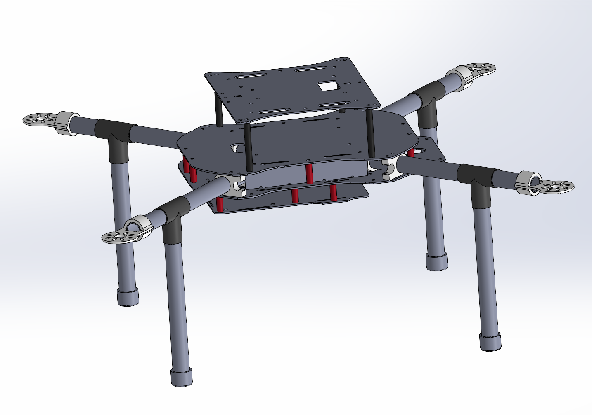
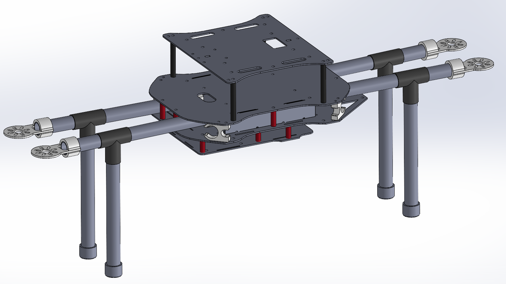
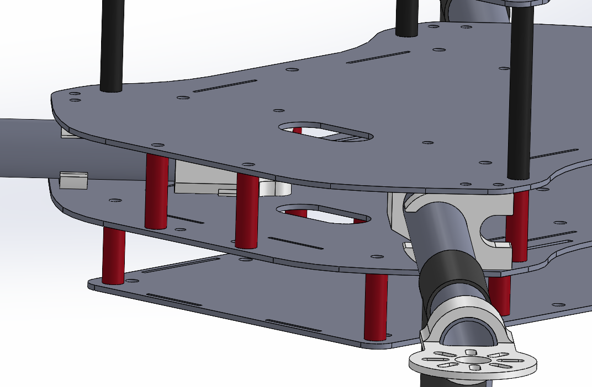
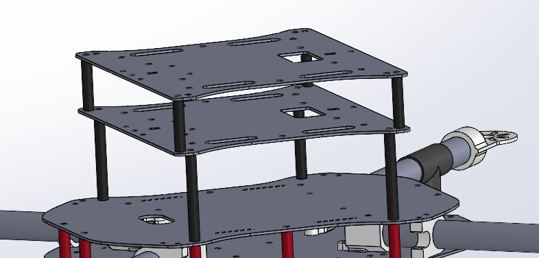
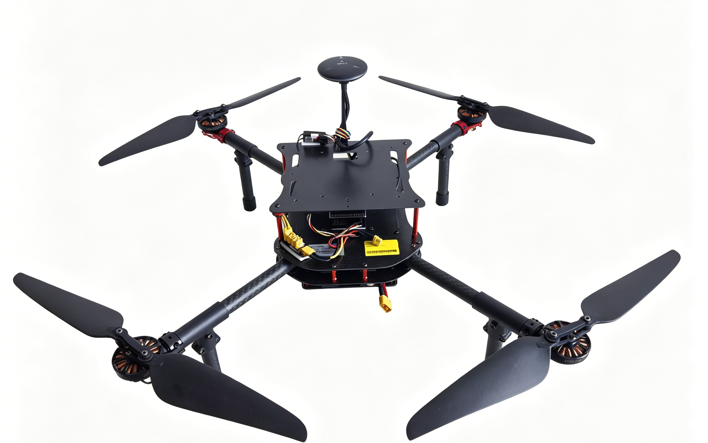

# snail-550机体平台

## 简介

​  无人机开发过程中不可避免需要大量飞行测试，非常需要一款趁手的机体平台，其应该易于组装、收纳方便、有较大的安装空间、零配件齐全且易于拆装更换。买过很多机体，总是不满意，虽然不是结构设计专业，但希望自己能动手设计一款面向开发者的无人机机体！

​  机体为四轴"X"构型，主体采用碳板堆叠结构，碳板留有过孔，便于线缆连接，空间结构设计合理，可满足绝大部分飞控的安装，机臂杆可对内折叠方便收纳，兼容主流动力系统（电机、电调）安装尺寸，满足任意搭配需求。

​  所有零配件均为市面上标准且成熟产品，供货可靠稳定，极大方便了维修，避免小破损导致整机更换带来的高昂成本。

​  载荷安装板支持堆叠扩展，安装空间翻倍！

​  整机效果如下图：

## 基本参数

### 尺寸

​  对角轴距584mm，左右轴距402mm，前后轴距422mm，可支持安装最大15寸桨。

### 重量

​  机体平台重量约500g。

## 优点

### 机臂杆可折叠

### 板上预留过孔

### 载荷板可叠拼

## 材料清单

碳纤维材料包括：

| 材料名称   | 单位 | 数量 | 说明                     |
| ---------- | ---- | ---- | ------------------------ |
| 机身上板   | 个   | 1    | 用于飞控安装等设备       |
| 机身下板   | 个   | 1    | 用于四合一电调等设备安装 |
| 电池安装板 | 个   | 1    | 下挂电池                 |
| 载荷扩展板 | 个   | 1    | 支持多层堆叠             |
| 机臂杆     | 根   | 4    | 长度21cm                 |
| 脚架杆     | 根   | 4    | 长度15cm                 |

其余结构配件材料（都是市面上标准产品）包括：

| 材料名称           | 单位 | 数量 | 说明                                       |
| ------------------ | ---- | ---- | ------------------------------------------ |
| 电机座红           | 个   | 2    | 电机安装                                   |
| 电机座黑           | 个   | 2    | 电机安装                                   |
| Tarot飞越折叠夹-红 | 个   | 2    | 可夹16mm碳管，带阶梯螺丝（M2.5 TL2778-01） |
| Tarot飞越折叠夹-黑 | 个   | 2    | 可夹16mm碳管，带阶梯螺丝（M2.5 TL2778-01） |
| 红色六边铝柱       | 个   | 16   | M3x21mm，用于机体上下碳板连接              |
| 铝柱双孔           | 个   | 4    | M3x12mm，黑色，用于固定电调                |
| 铝柱双孔           | 个   | 4    | M3x50mm长，黑色，用于载荷板与机体连接      |
| 圆头螺丝           | 个   | 32   | M3*6                                       |
| 圆头螺丝           | 个   | 4    | M3*10                                      |
| 螺丝               | 个   | 20   | M2.5*6                                     |
| 电池绑带           | 根   | 2    | 2cm宽，30cm长                              |
| 机臂碳管护套       | 个   | 4    | 外径14mm，用于机臂杆防护                   |
| 硅胶帽套管         | 个   | 4    | 用于脚架防护                               |
| 脚架连接件三通     | 个   | 4    | 16mm转16mm，塑料材质                       |
| 电源接头固定座     | 个   | 1    | XT60接头固定座                             |

## 组装示例

