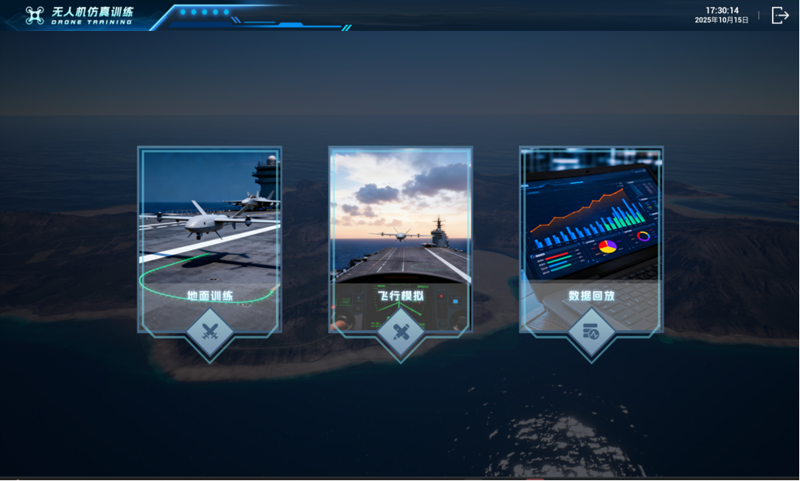

# 产品中心

NextPilot 提供一系列高性能、高可靠性的无人系统核心组件，覆盖飞行控制、大气传感、差分定位、仿真训练与无人机机体五大领域。

---

## 硬件产品

- {: style="height:160px;margin-bottom:0.5rem" }

    ### :material-memory: 飞行控制计算机

    ---

    [NP-FCC-H50](01-飞行控制计算机/01-NP-FCC-H50.md) 新一代高性能导航飞控计算机，集成双频RTK、三冗余IMU和工业级处理器，为无人系统提供精准的导航、制导与控制。

    [:octicons-arrow-right-24: 查看详情](01-飞行控制计算机/index.md)

- {: style="height:160px;margin-bottom:0.5rem" }

    ### :material-gauge: 大气数据计算机

    ---

    [NP-ADS-H50](03-大气数据计算机/01-NP-ADS-H50.md) 工业级数字空速计，内置高性能差压传感器与气压传感器，精确测量空速、气压高度与温度，采用航空连接器，稳定可靠。

    [:octicons-arrow-right-24: 查看详情](03-大气数据计算机/index.md)

- {: style="height:160px;margin-bottom:0.5rem" }

    ### :material-antenna: 地面差分基准站

    ---

    [NP-BASE-H50](05-地面差分基准站/01-NP-BASE-H50.md) 便携式地面差分基准站，支持RTCM差分数据输出，配合机载RTK模块实现厘米级动态定位精度，通信接口采用航空连接器，稳定可靠。

    [:octicons-arrow-right-24: 查看详情](05-地面差分基准站/index.md)

---

## 软件产品

- {: style="height:160px;margin-bottom:0.5rem" }

    ### :material-monitor-dashboard: 飞行训练模拟器

    ---

    [NP-Simulator](06-飞行训练模拟器/01-NP-Simulator.md)，面向专业培训机构与行业应用单位的高等级无人机飞行训练模拟器，以高精度飞行动力学模型与三维仿真引擎为核心，覆盖技能养成全周期的沉浸式训练平台。

    [:octicons-arrow-right-24: 查看详情](06-飞行训练模拟器/index.md)

---

## 无人机平台

- {: style="height:160px;margin-bottom:0.5rem" }

    ### :material-drone: 无人机平台

    ---

    [snail-550 机体平台](10-无人机平台/snail-550.md)，面向开发者的无人机机体平台，采用碳板堆叠结构与可折叠机臂设计，易于组装、收纳方便，兼容主流动力系统，满足飞行测试与应用需求。

    [:octicons-arrow-right-24: 查看详情](10-无人机平台/snail-550.md)

