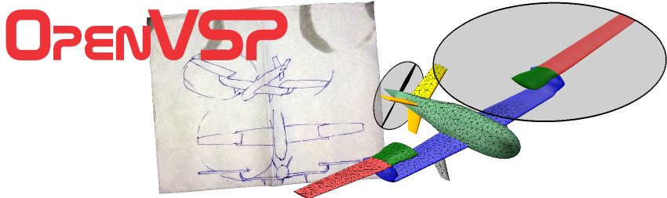

# 无人机总体设计优化

NextPilot 团队提供飞行器概念设计、气动外形优化、飞行性能评估等总体设计服务，帮助客户在方案阶段快速迭代、降低设计风险。

!!! note "一体化交付"
    气动数据与动力学模型可直接对接 PX4 飞控的 [虚拟飞行仿真](../develop/08.飞行仿真/README.md)，实现从总体设计到飞控验证的完整闭环，避免重复建模，显著缩短研发周期。

---

## 气动数据库计算和分析（CFD）

[OpenVSP](https://openvsp.org/) 是一款由 NASA 开发的免费开源飞行器三维建模软件，支持 Windows、Linux 和 macOS。

OpenVSP 采用参数化建模方式，允许用户通过通用工程参数定义飞行器 3D 模型，之后可处理成适合工程分析的格式。OpenVSP 已被工业界、政府和学术界广泛采用，覆盖无人机、eVTOL、民用超音速、高超音速、太空发射和小型卫星等领域。

- **气动数据库建立**：基于 CFD 方法计算飞行器全飞行包线的气动数据，为飞控系统设计提供精确的气动系数（升力系数、阻力系数、力矩系数等）。
- **气动外形优化**：利用参数化建模快速迭代优势，对机翼、尾翼、机身等部件进行气动外形优化设计，平衡气动效率与结构可行性。
- **流场可视化分析**：提供压力分布、流线图、涡量图等流场可视化结果，直观展示气动特性，辅助设计决策。
- **多工况计算**：覆盖起飞、巡航、降落等典型工况，以及侧风、大迎角等特殊飞行状态的气动特性分析。

---

## 飞行性能评估和操稳分析

基于 CFD 计算所得的气动数据库，进行全面的飞行性能评估与操稳特性分析：

### 飞行性能

- **起飞性能**：起飞距离、起飞时间、爬升率、越障能力等关键指标评估。
- **巡航性能**：最大航程、最大航时、最佳巡航速度、燃油/电量消耗率计算。
- **着陆性能**：着陆距离、下滑角、接地速度、复飞能力分析。
- **机动性能**：最大平飞速度、升限、盘旋半径、滚转速率等机动能力评估。
- **载荷能力**：不同载荷重量下的飞行性能变化分析，确定飞行包线边界。

### 操稳分析

- **静稳定性**：纵向静稳定裕度、横航向静稳定性分析，确保飞行器具备基本的自稳能力。
- **动稳定性**：短周期模态、长周期（Phugoid）模态、荷兰滚模态、螺旋模态、滚转收敛模态等典型模态特性分析。
- **操纵响应**：升降舵、副翼、方向舵等舵面的操纵效率评估，以及各通道的操纵导数计算。
- **配平分析**：不同飞行状态下的舵面配平角度、配平阻力计算，为飞控系统控制律设计提供输入。

---

## 非线性飞行动力学建模（6DOF）

建立飞行器 **六自由度非线性动力学模型**，为控制律设计、飞行品质评估和仿真验证提供支撑：

- **非线性动力学建模**：采用标准 12 阶微分方程描述飞行器位置、姿态、速度、角速度的完整运动状态。
- **气动数据插值**：基于 CFD 气动数据库，建立多维插值模型，实现任意飞行状态下的气动力/力矩实时计算。
- **环境模型集成**：集成标准大气模型、风场模型（定常风/突风/紊流）、地球重力模型等，构建真实飞行环境。
- **执行机构模型**：包含电机/发动机推力模型、舵机动力学模型、传感器噪声模型等，提高仿真保真度。
- **Simulink 集成**：支持将 6DOF 模型导出为 Simulink 模块，方便与 PX4 控制律进行模型化联仿和 MIL/SIL/HIL 验证。
