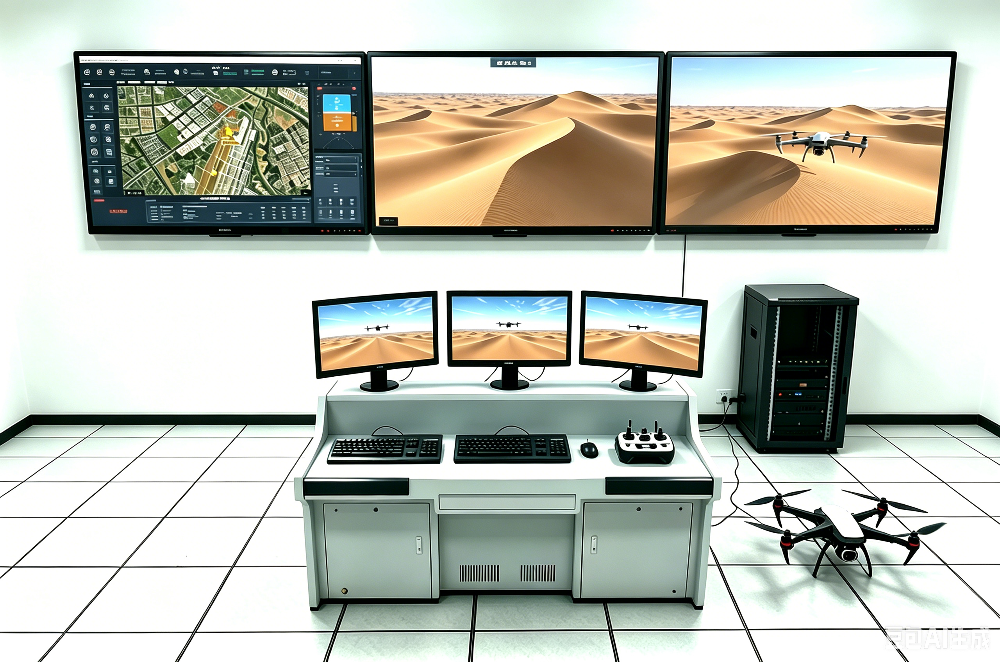
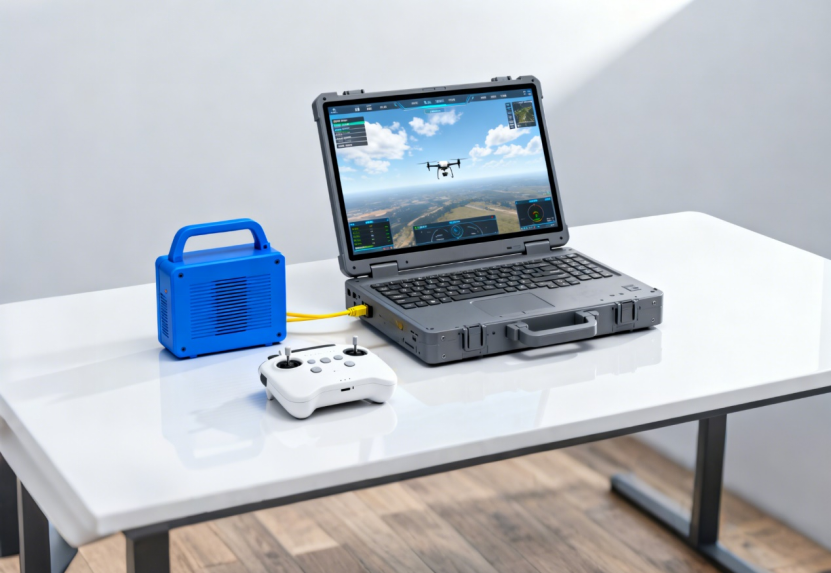

# SiM飞行训练模拟器

## 简介

本产品是一款面向专业培训机构、行业应用单位及院校的高等级无人机飞行仿真模拟训练系统，致力于解决无人机操控人才培养中“训练设备适配性差、仿真度低、教学资源零散”等行业痛点。系统以高精度飞行动力学模型与三维仿真引擎为核心，严格遵循真实飞行原理与行业作业规范，打造覆盖技能养成全周期的沉浸式训练平台。

## 核心功能

- 多机型高保真飞行操控仿真
- 行业级任务流程深度模拟
- 特情处置与应急训练
- 教员控制与教学管理
- 多机协同与编队训练

## 产品形态

产品包括基地级和便携式两种形态，核心功能一致，通过配置外设满足不同场景需求。

| 特性     | 基地级                                  | 便携式                   |
| -------- | --------------------------------------- | ------------------------ |
| 安装方式 | 固定安装                                | 灵活部署，可随时开展训练 |
| 显示配置 | 大屏×3 + 小屏×3，独立显示态势/视景/载荷 | 移动工作站一体显示       |
| 操控席位 | 3 人席位控制台                          | 便携操作                 |
| 适用场景 | 固定训练中心、基地                      | 外场训练                 |

## 技术特点

**1. 高保真飞行动力学模型**

系统基于精确的空气动力学模型与无人机物理特性，真实模拟飞行姿态变化。采用六自由度（6DOF）运动平台（可选），动态反馈姿态变化及风扰冲击，强化飞手空间感知与操控本能。

**2. 沉浸式视景系统**

采用虚幻引擎（UE5）开发，营造逼真的三维飞行环境。支持海洋、舰船、城市、山区等多种真实地形与工业场景。可选配超宽分辨率环幕或VR头显，提供沉浸式视觉体验。

**3. 全地形全天候仿真**

系统可实现多型无人机在全天候、全地形条件下的仿真训练，支持气象条件（风速、风向、能见度、降水等）的动态叠加与调节。

**4. 硬件在环（HIL）与软件在环（SITL）双模支持**

系统支持软件在环与硬件在环两大仿真模式。仿真参数可一键同步至真机，形成“仿真—调参—实飞—复盘”的完整闭环，既降低真机试飞损耗与安全风险，又实现训练成果向实战的无缝迁移。

**5. 模块化开放架构**

系统采用开放式软件架构，便于移植和适配，可快速适配多种无人装备。支持模块化扩展，可搭配VR/AR设备、六自由度运动平台等多种形式灵活组合。提供开放SDK，兼容主流开发工具。

**6. 国产自主可控**

系统核心软硬件实现自主可控——硬件通过精简电路设计、升级国产主控芯片，显著降低成本的同时提升采样精度；软件以国产实时操作系统为核心，整合定位、控制等多功能模块。
